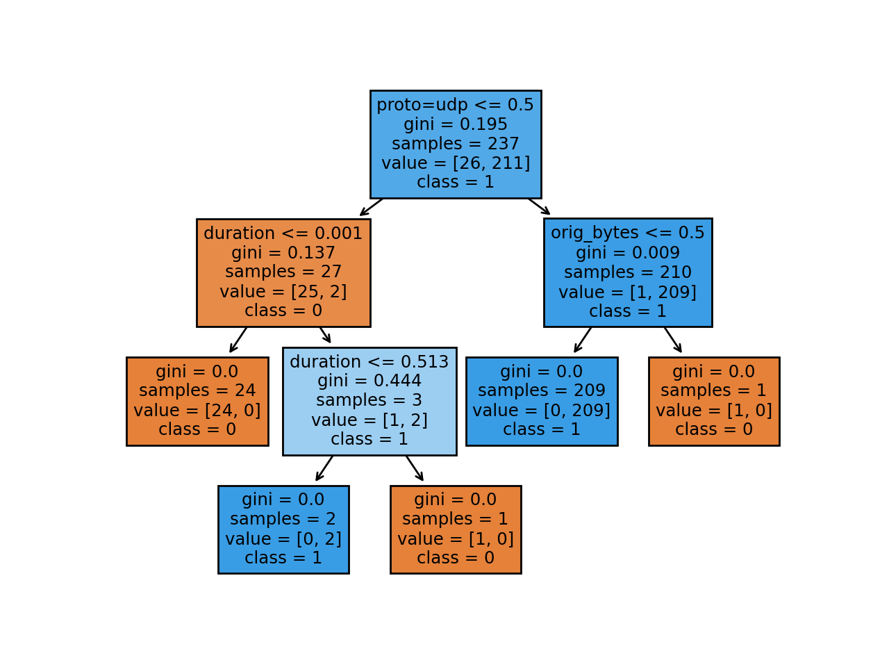

# Adversarial 

So far:

- [x] decision tree classifier implementation in `src/tree.py` (implemented using [scikit learn decision trees][1])

    ```text
    python src/tree.py
    ```
  
- [ ] Try apply [Adversarial Robustness Toolbox][2] to this tree, some unknowns:
    
  - what adversarial methods/tools apply to trees in this toolbox?
  - I believe we want: extraction, on this trained tree model
  
  
Here is a tree visualization:
  
   
  
  
  
[1]: https://scikit-learn.org/stable/modules/tree.html  
[2]: https://adversarial-robustness-toolbox.readthedocs.io/en/latest/
