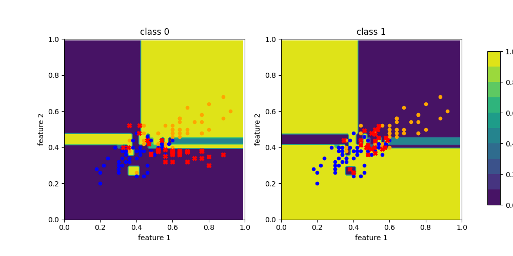
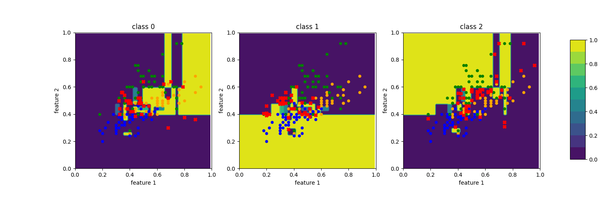
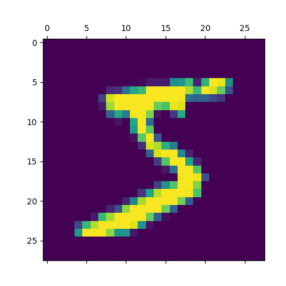
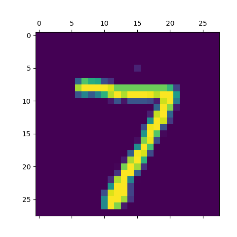

# Adversarial attacks

Progress so far:

1. ✔ basic decision tree classifier implementation in `src/tree.py` -- [scikit learn decision tree][1] trained using IoT23 dataset

    ```text
    python src/tree.py 
    ```

2. ✔ Implement adversarial examples: these are example evasion attacks to demonstrate use of [Adversarial Robustness Toolbox][2],
   applying Zeroth-Order Optimization (ZOO) attack. Evasion attacks attempt to evade detection by obfuscating the content.

    ```text
    python src/adv_iris.py
    python src/adv_mnist.py
    ```
    
3. [ ] Apply attack (from step 2) to the tree (from step 1) 


* * *   
  
### Tree visualization
  
   

### Evasion attack results

**Adversarial evasion on iris dataset**

- colored background: probability of class i
- orange circles: class 1
- blue circles: class 2
- green circles: class 3
- red crosses: adversarial samples for class i





**Adversarial evasion on MNIST**

| Benign train               | Adversarial train       |
|----------------------------|-------------------------|
|  |  | 
| Score: 1.0000              | Score: 0.1200           |
| Predicted Label: 5         | Predicted Label: 2      |


| Benign test               | Adversarial test       |
|---------------------------|------------------------|
|  |  |
| Score: 0.4100             | Score: 0.1700          | 
| Predicted Label: 7        | Predicted Label: 5     | 

  
<!-- references -->
  
[1]: https://scikit-learn.org/stable/modules/tree.html  
[2]: https://adversarial-robustness-toolbox.readthedocs.io/en/latest/
