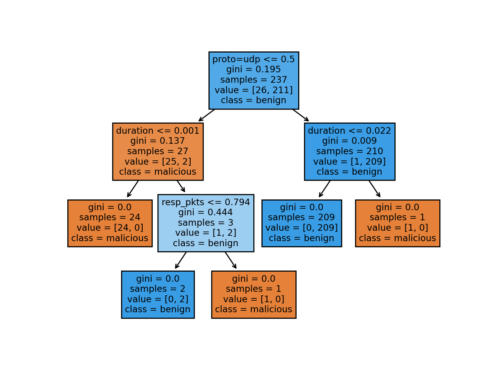

# Adversarial 

Progress so far:

1. [x] basic decision tree classifier implementation in `src/tree.py` (implemented using [scikit learn decision trees][1])

    ```text
    python src/tree.py 
    ```
    
2. [ ] Apply [Adversarial Robustness Toolbox][2] to the tree:
    
  
  
Tree visualization:
  
   
  
  
  
[1]: https://scikit-learn.org/stable/modules/tree.html  
[2]: https://adversarial-robustness-toolbox.readthedocs.io/en/latest/
