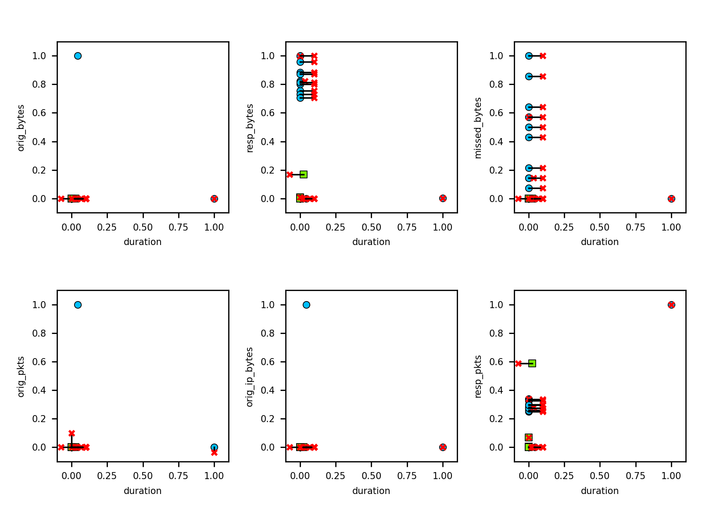

# Adversarial attacks

Progress so far:

1. Basic decision tree classifier implementation in `src/tree.py` -- [scikit learn decision tree][1] trained using IoT23 dataset

    ```text
    python src/tree.py 
    ```

2. Implement adversarial examples: these are example evasion attacks to demonstrate use of [Adversarial Robustness Toolbox][2]

    ```text
    python src/adv_iris.py         # Z00 evasion attack
    python src/adv_mnist.py        # Z00 evasion attack
    python src/inf_nursery.py      # attribute inference attack 
    ```
    
3. Apply various attacks (from step 2) to the tree (from step 1)  

* * *   

### Attribute inference attack

```
python src/inf_iot.py
```

The attacked feature must be categorical, and with a relatively small
number of possible values (preferably binary, but should at least be
less then the number of label classes).

Output of black-box inference on attributes `proto=udp` and `conn_state=SF`

```text
Read dataset: adversarial/CTU-44-1
Attributes:   22
Instances:    237
Base model accuracy:  98.31 %

Inferred black box data: 
 [1 1 1 1 1 1 1 1 1 1 1 1 1 1 1 1 1 1 1 1 1 1 1 1 1 1 1 1 1 1 1 1 1 1 1 1 1
 1 1 1 1 1 1 1 1 1 1 1 1 1 1 1 1 1 1 1 1 1 1 1 1 1 1 1 1 1 1 1 1 1 1 1 1 1
 1 1 1 1 1 1 1 1 1 1 1 1 0 1 1]
Blackbox accuracy (proto=udp): 100.00 %

Inferred black box data: 
 [1 0 0 1 1 1 1 1 1 1 1 0 1 1 1 1 1 0 1 1 1 1 1 1 1 1 0 1 1 1 1 1 1 1 1 1 1
 1 0 0 0 1 1 1 0 0 0 0 1 0 0 1 0 1 0 0 0 0 0 0 1 0 0 0 0 0 1 1 0 1 1 1 0 1
 1 0 0 0 0 1 1 0 0 0 0 0 0 0 0]

Blackbox accuracy (conn_state=SF): 100.00 %
```
  
### Evasion attack results

Applying Zeroth-Order Optimization (ZOO) Attack:

```text
python src/adv_iot.py
```

- blue circles: malicious training 
- green circles: benign training 
- red crosses: adversarial modified instance
- black line: difference between original and adversarial

 
 
 
 
  
 
 
 

### Tree visualization
  
   

  
<!-- references -->
  
[1]: https://scikit-learn.org/stable/modules/tree.html  
[2]: https://adversarial-robustness-toolbox.readthedocs.io/en/latest/
