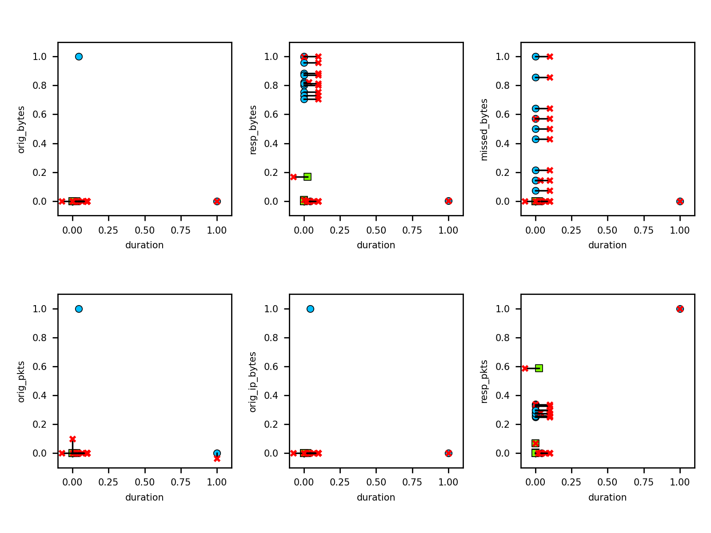
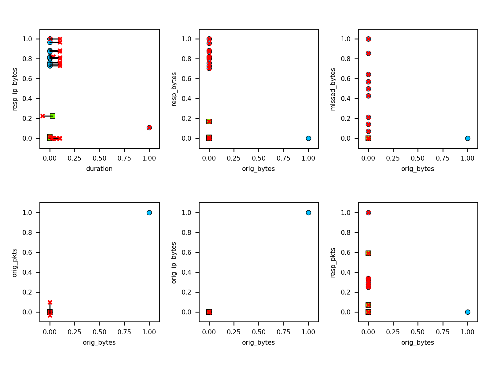
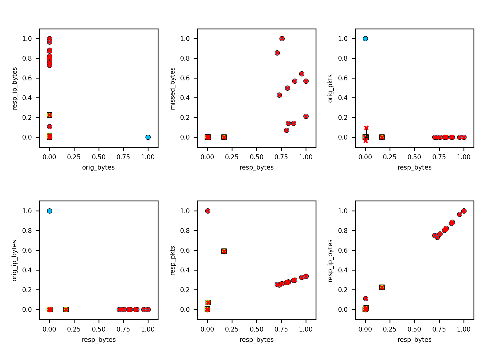
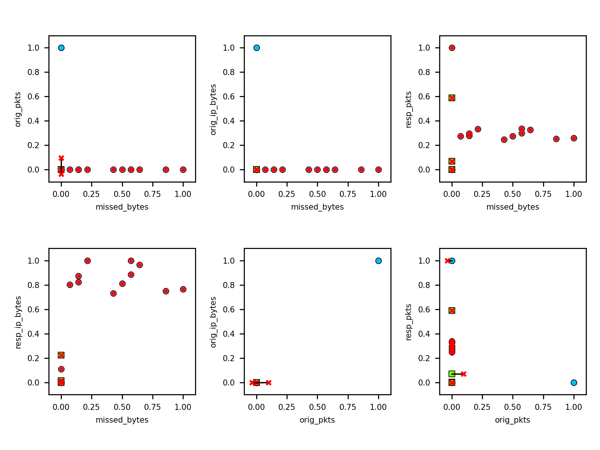
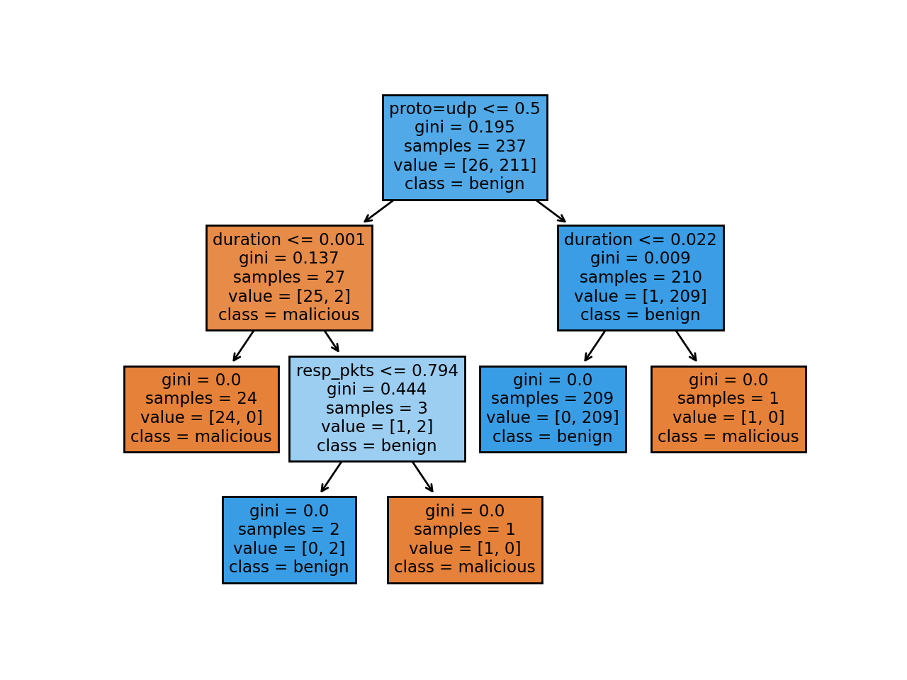

# Adversarial attacks on decision tree classifier

We apply adversarial attacks on a (single) non-robust decision tree, trained using IoT-23 dataset:
CTU-Malware-Capture-44-1, with 237 rows (benign 211, malicious 26), 90 / 10 split; trained using basic
[scikit learn decision tree][1]. We then apply various adversarial attacks from the [Adversarial Robustness Toolbox][2]
to attack this classifier.


## Implementation steps

1. Basic decision tree classifier implementation in `src/tree.py`

    ```text
    python src/tree.py 
    ```

2. Implement adversarial examples

    ```text
    python src/examples/zoo_iris.py         # Z00 evasion attack on iris data
    python src/examples/zoo_mnist.py        # Z00 evasion attack on MNIST data
    python src/examples/inf_nursery.py      # attribute inference attack on nursery dataset
    ```
    
3. Apply various attacks (from step 2) to the tree (from step 1)  

* * *   

## Results

### Attribute inference attack

```
python src/attack_inf.py
```

The attacked feature must be categorical, and with a relatively small
number of possible values (preferably binary, but should at least be
less then the number of label classes).

Output of black-box inference on attributes `proto=udp` and `conn_state=SF`

```text
Read dataset ----------------- adversarial/CTU-44-1
Attributes ------------------- 22
Classes ---------------------- 0, 1
Training instances ----------- 177
Test instances --------------- 60
Split for score -------------- 0 (8) | 1 (52)
Score ------------------------ 95.00 %
Base model accuracy----------- 95.00 %
* Inference of attribute proto=udp:
Baseline attack -------------- Accuracy: 100.00 % Precision: 100.00 % Recall: 100.00 %
Black box attack ------------- Accuracy: 100.00 % Precision: 100.00 % Recall: 100.00 %
White box 1 attack ----------- Accuracy: 100.00 % Precision: 100.00 % Recall: 100.00 %
White box 2 attack ----------- Accuracy: 88.76 % Precision: 100.00 % Recall: 0.00 %
Membership attack ------------ Accuracy: 88.76 % Precision: 100.00 % Recall: 0.00 %
* Inference of attribute conn_state=SF:
Baseline attack -------------- Accuracy: 100.00 % Precision: 100.00 % Recall: 100.00 %
Black box attack ------------- Accuracy: 100.00 % Precision: 100.00 % Recall: 100.00 %
White box 1 attack ----------- Accuracy: 65.17 % Precision: 100.00 % Recall: 0.00 %
White box 2 attack ----------- Accuracy: 65.17 % Precision: 100.00 % Recall: 0.00 %
Membership attack ------------ Accuracy: 34.83 % Precision: 34.83 % Recall: 100.00 %
```

**Inference attack methods**

- [**Baseline attack**][BL]: Implementation of a baseline attribute inference, not using a model. The idea is to 
    train a simple neural network to learn the attacked feature from the rest of the features. Should be used to 
    compare with other attribute inference results. 

- [**Black box attack**][BB]: Implementation of a simple black-box attribute inference attack. The idea is to train 
    a simple neural network to learn the attacked feature from the rest of the features and the model’s predictions. 
    Assumes the availability of the attacked model’s predictions for the samples under attack, in addition to the rest 
    of the feature values. If this is not available, the true class label of the samples may be used as a proxy. 

- [**White-box 1 attack**][W1]: A variation of the method proposed by of Fredrikson et al. Assumes the availability of 
    the attacked model’s predictions for the samples under attack, in addition to access to the model itself and the 
    rest of the feature values. If this is not available, the true class label of the samples may be used as a proxy. 
    Also assumes that the attacked feature is discrete or categorical, with limited number of possible values, for 
    example: a boolean feature. Paper link: <https://dl.acm.org/doi/10.1145/2810103.2813677>

- [**White-box 2 attack**][W2]: Implementation of Fredrikson et al. white box inference attack for decision trees. 
    Assumes that the attacked feature is discrete or categorical, with limited number of possible values, for 
    example: a boolean feature. Paper link: <https://dl.acm.org/doi/10.1145/2810103.2813677>
     
- [**Membership attack**][MS]: Implementation of an attribute inference attack that utilizes a membership inference 
    attack. The idea is to find the target feature value that causes the membership inference attack to classify the 
    sample as a member with the highest confidence.

  
### ZOO Evasion attack

Applying Zeroth-Order Optimization (ZOO) Attack:

```text
python src/attack_zoo.py
```

- blue circles: malicious training 
- green circles: benign training 
- red crosses: adversarial modified instance
- black line: difference between original and adversarial

 
 
 
 
  
 
 
 

### Decision tree visualization
  
   

  
<!-- references -->
  
[1]: https://scikit-learn.org/stable/modules/tree.html  
[2]: https://adversarial-robustness-toolbox.readthedocs.io/en/latest/

[BL]: https://adversarial-robustness-toolbox.readthedocs.io/en/latest/modules/attacks/inference/attribute_inference.html#attribute-inference-baseline
[BB]: https://adversarial-robustness-toolbox.readthedocs.io/en/latest/modules/attacks/inference/attribute_inference.html#attribute-inference-black-box
[W1]: https://adversarial-robustness-toolbox.readthedocs.io/en/latest/modules/attacks/inference/attribute_inference.html#attribute-inference-white-box-decision-tree
[W2]: https://adversarial-robustness-toolbox.readthedocs.io/en/latest/modules/attacks/inference/attribute_inference.html#attribute-inference-white-box-lifestyle-decision-tree
[MS]: https://adversarial-robustness-toolbox.readthedocs.io/en/latest/modules/attacks/inference/attribute_inference.html#attribute-inference-membership
