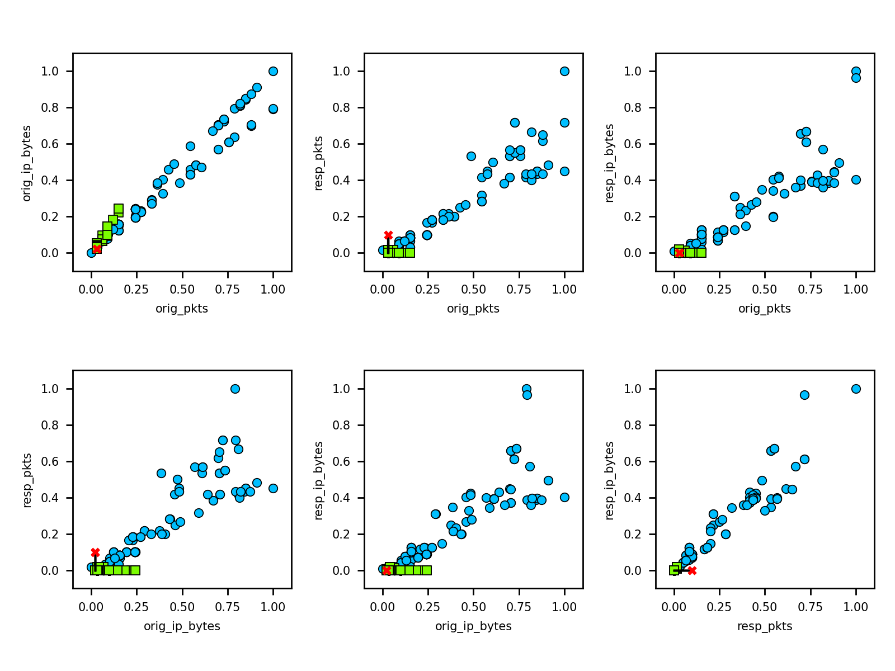
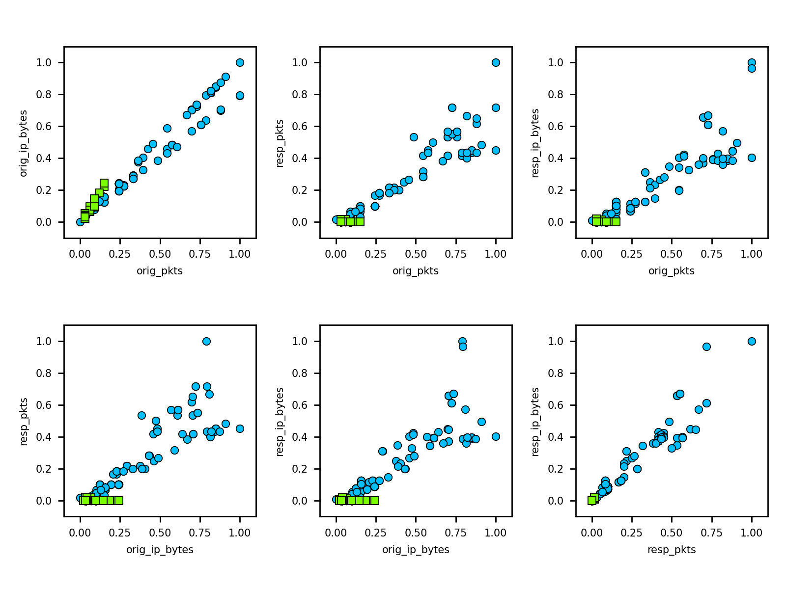
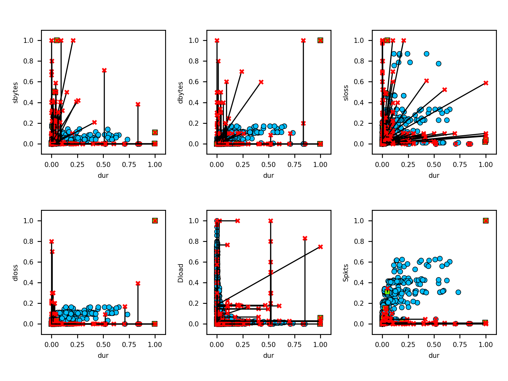
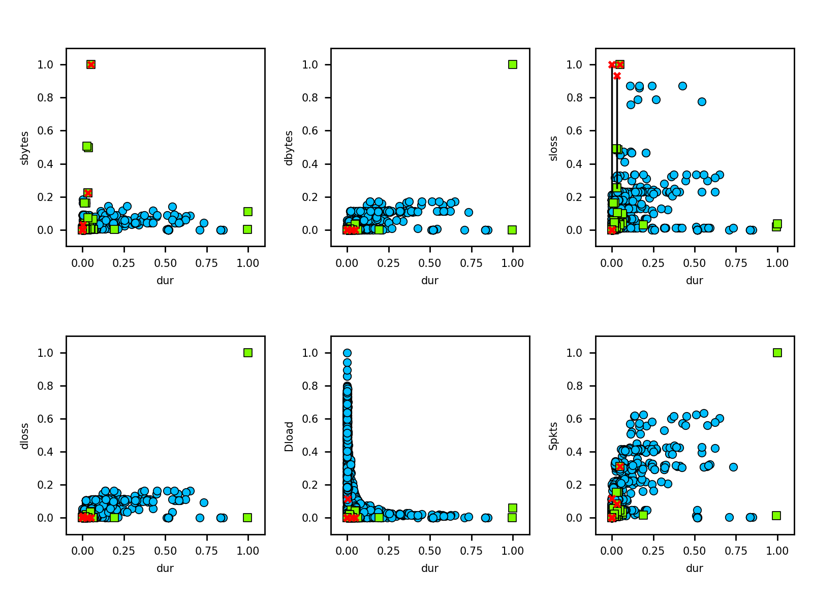
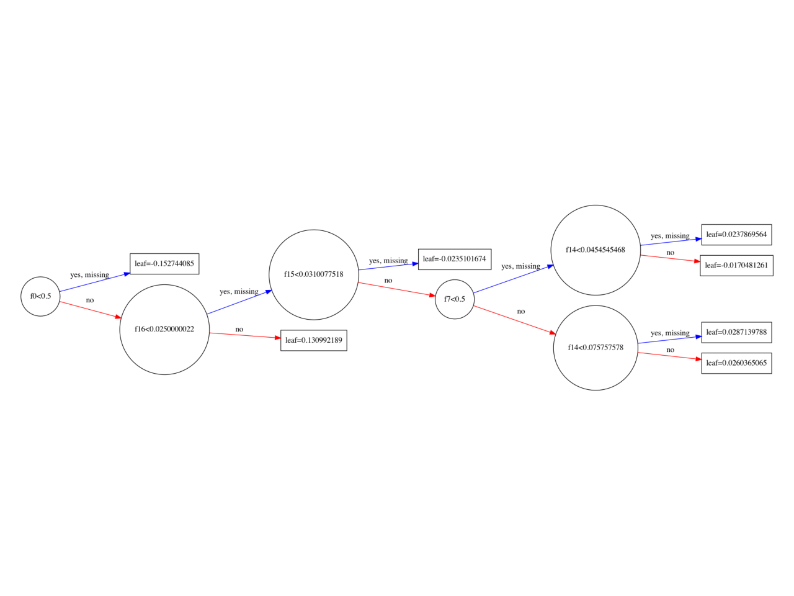
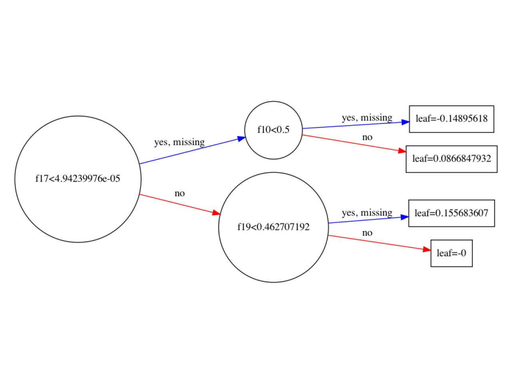
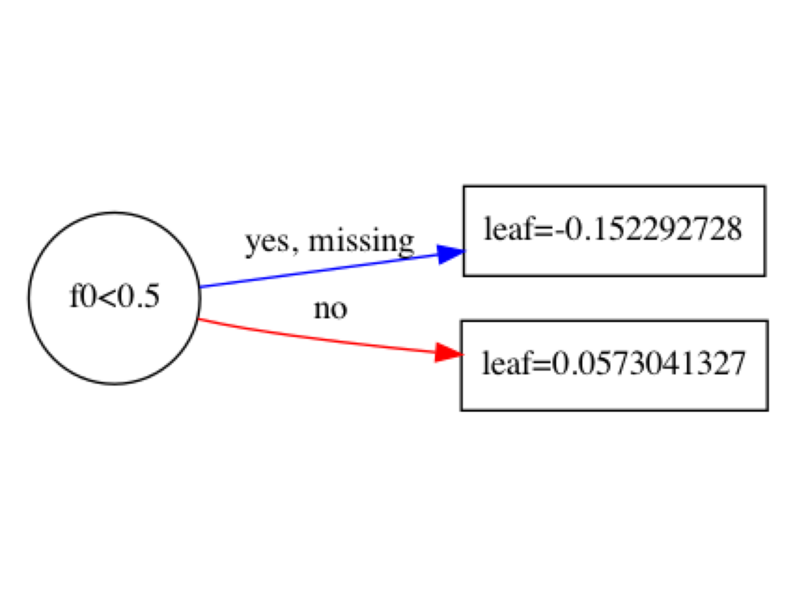

# Adversarial attacks on XGBoost classifier

We use XGBoost [RobustTrees](https://github.com/chenhongge/RobustTrees) classifier implementation.
It must be built locally  [following instructions here](https://github.com/chenhongge/RobustTrees/tree/master/python-package#from-source).

After local build, set up Python environment to use this classifier version:

```
python -m pip install -e "/absolute/local/path/to/RobustTrees/python-package"
```

Then run the attacks using the robust classifier. Per Instructions:

> **Configuration Parameters**
> 
> We added two additional parameters to XGBoost:
> 
> (1) tree_method controls which training method to use. We add a new option `robust_exact` for 
> this parameter. Setting `tree_method = robust_exact` will use our proposed robust training. 
> For other training methods, please refer to XGBoost documentation.
> 
> (2) `robust_eps` is the L inifity perturbation norm (epsilon) used in training. Since the same 
> epsilon value will be applied for all features, it is recommended to normalize your data 
> (e.g., make sure all features are in range 0 - 1). Normalization will not change tree performance
> 

Please refer to [XGBoost Documentation](https://xgboost.readthedocs.io/) for all other parameters used in XGBoost.

## Run attacks

```
python src/run_attacks.py
```

will run all attacks for robust and non-robust configurations on default dataset. Append path to dataset to use a
different data set:

```
python src/run_attacks.py ./path/to/input_data.csv
```

## ZOO Evasion attack

Applying Zeroth-Order Optimization (ZOO) Attack:

- blue circles: malicious training 
- green circles: benign training 
- red crosses: adversarial modified instance
- black line: difference between original and adversarial

Dataset: [CTU-Malware-Capture-1-1](../data/CTU-1-1.csv) (53 / 47 split)

**Results**

Dataset: [CTU-1-1.csv](../data/CTU-1-1.csv)

```
Read dataset ----------------- data/CTU-1-1.csv
Attributes ------------------- 19
Classifier ------------------- XGBoost, robust: False
Classes ---------------------- benign, malicious
Training split --------------- 53.2/46.8
Training instances ----------- 12609
Test instances --------------- 0
Accuracy --------------------- 95.86 %
Precision -------------------- 100.00 %
Recall ----------------------- 91.15 %
F-score ---------------------- 95.37 %
Evasion success -------------- 4 (0.03 %)


Read dataset ----------------- data/CTU-1-1.csv
Attributes ------------------- 19
Classifier ------------------- XGBoost, robust: True
Classes ---------------------- benign, malicious
Training split --------------- 53.2/46.8
Training instances ----------- 12609
Test instances --------------- 0
Accuracy --------------------- 95.86 %
Precision -------------------- 100.00 %
Recall ----------------------- 91.15 %
F-score ---------------------- 95.37 %
Evasion success -------------- 0 (0.00 %)
```

| **Non-Robust XGBoost**     |
|:---------------------------|
|  |
| **Robust XGBoost**         |
|      |

Dataset: [nb15_1_1.csv](../data/nb15_1_1.csv)

```
Read dataset ----------------- data/nb15_1_1.csv
Attributes ------------------- 41
Classifier ------------------- XGBoost, robust: False
Classes ---------------------- benign, malicious
Training split --------------- 2.9/97.1
Training instances ----------- 7000
Test instances --------------- 0
Accuracy --------------------- 100.00 %
Precision -------------------- 100.00 %
Recall ----------------------- 100.00 %
F-score ---------------------- 100.00 %
Evasion success -------------- 438 (6.26 %)


Read dataset ----------------- data/nb15_1_1.csv
Attributes ------------------- 41
Classifier ------------------- XGBoost, robust: True
Classes ---------------------- benign, malicious
Training split --------------- 2.9/97.1
Training instances ----------- 7000
Test instances --------------- 0
Accuracy --------------------- 97.23 %
Precision -------------------- 98.27 %
Recall ----------------------- 98.88 %
F-score ---------------------- 98.58 %
Evasion success -------------- 29 (0.41 %)
```

| **Non-Robust XGBoost**    |
|:--------------------------|
|  |
| **Robust XGBoost**        |
|      |


## HopSkipJump Attack


**Results**

```
Read dataset ----------------- data/CTU-1-1.csv
Attributes ------------------- 19
Classifier ------------------- XGBoost, robust: False
Classes ---------------------- benign, malicious
Training split --------------- 53.2/46.8
Training instances ----------- 12609
Test instances --------------- 0
Accuracy --------------------- 95.86 %
Precision -------------------- 100.00 %
Recall ----------------------- 91.15 %
F-score ---------------------- 95.37 %
--------------------------------------------------
HOPSKIPJUMP ATTACK
--------------------------------------------------
Success rate ----------------- 100.00
Error min/max ---------------- 0.022092 - 0.667910
mutations: ------------------- 18 attributes
conn_state=OTH :: conn_state=RSTR :: proto=icmp :: orig_pkts :: conn_state=SH :: resp_ip_bytes :: resp_bytes :: conn_state=REJ :: orig_bytes :: orig_ip_bytes :: conn_state=SF :: proto=udp :: conn_state=S0 :: conn_state=RSTOS0 :: duration :: resp_pkts :: conn_state=RSTRH :: proto=tcp


Read dataset ----------------- data/CTU-1-1.csv
Attributes ------------------- 19
Classifier ------------------- XGBoost, robust: True
Classes ---------------------- benign, malicious
Training split --------------- 53.2/46.8
Training instances ----------- 12609
Test instances --------------- 0
Accuracy --------------------- 95.86 %
Precision -------------------- 100.00 %
Recall ----------------------- 91.15 %
F-score ---------------------- 95.37 %
--------------------------------------------------
HOPSKIPJUMP ATTACK
--------------------------------------------------
Success rate ----------------- 100.00
Error min/max ---------------- 0.647870 - 1.038313
mutations: ------------------- 18 attributes
conn_state=RSTR :: conn_state=RSTOS0 :: orig_bytes :: conn_state=REJ :: resp_bytes :: orig_pkts :: resp_ip_bytes :: conn_state=S0 :: conn_state=SF :: proto=udp :: orig_ip_bytes :: resp_pkts :: proto=icmp :: conn_state=RSTRH :: conn_state=OTH :: conn_state=SH :: duration :: proto=tcp
```

## XGBoosted trees visualizations

These are relevant as different models offer varying opportunities
for successful attacks.

#### CTU-1-1



#### CTU 44-1 



#### CTU 20-1



## Notes

These results previously included [inference attack](../src/attack_inf.py) which is no longer relevant after
  narrowing focus to evasion attacks.


 
