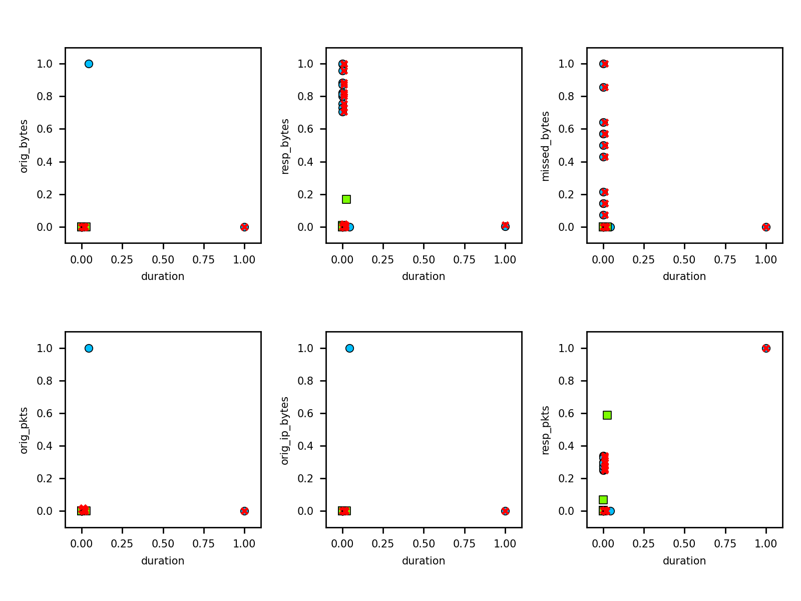
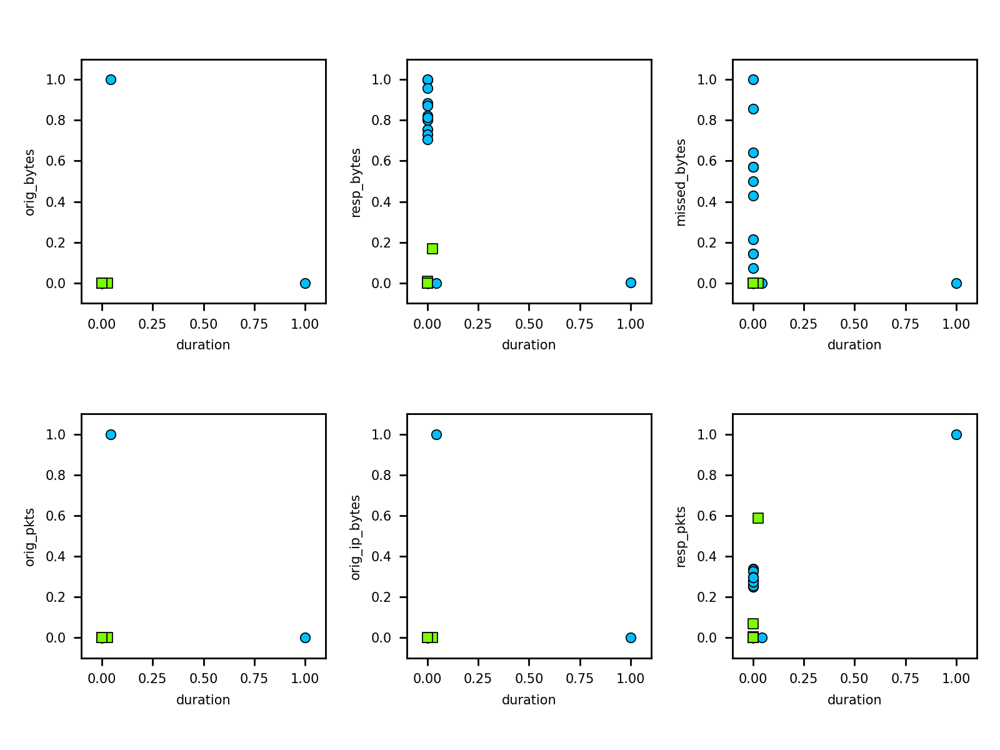
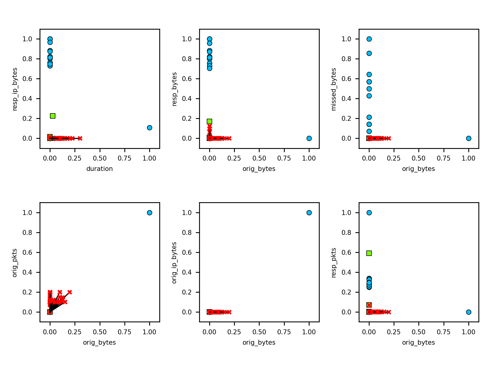
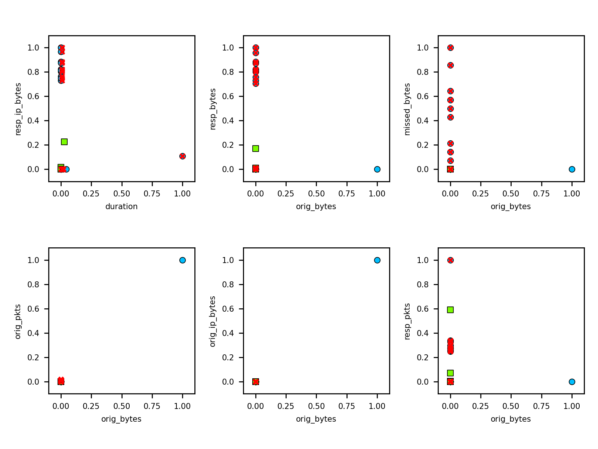
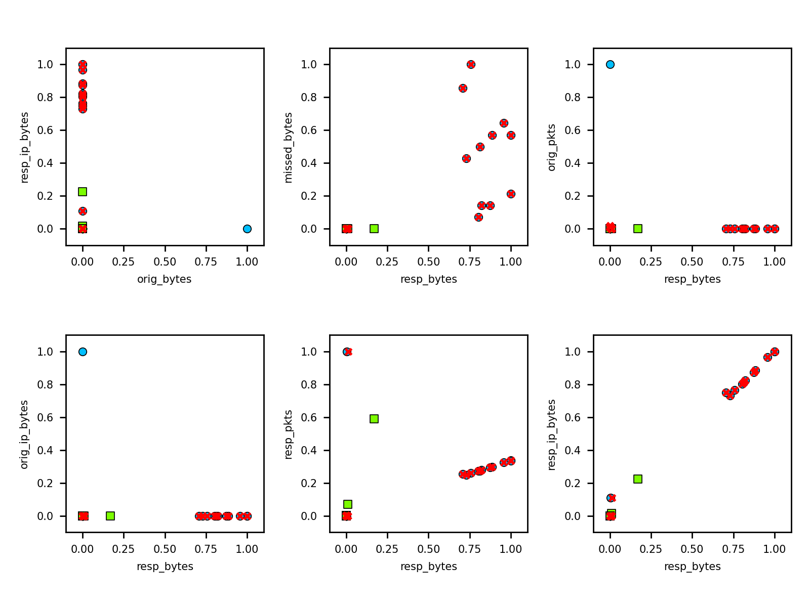
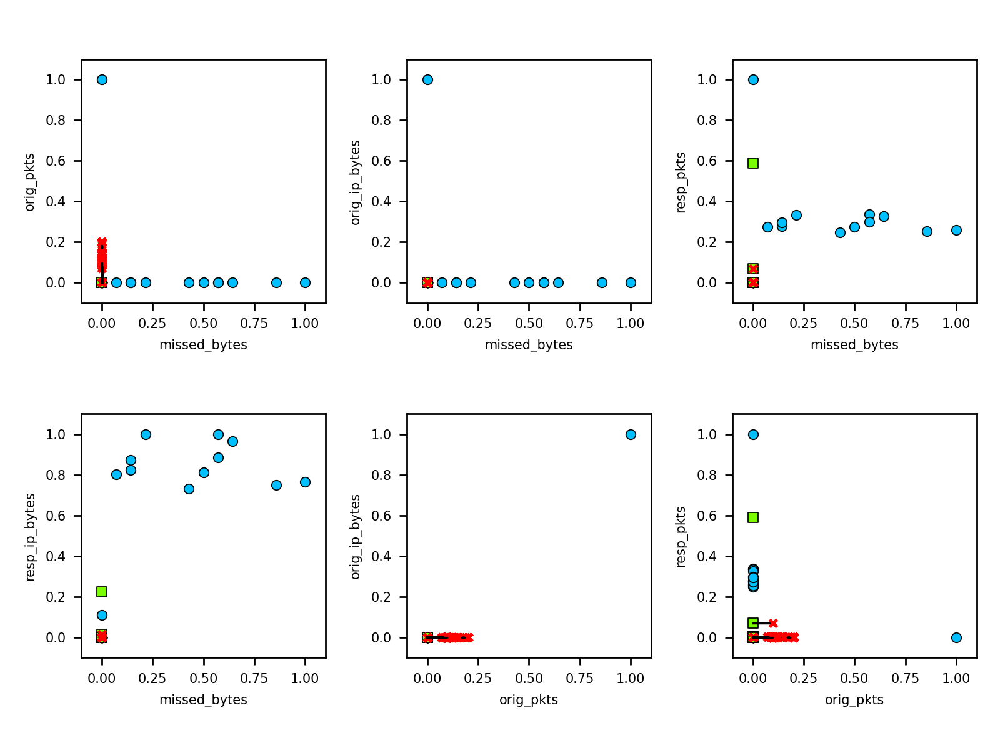
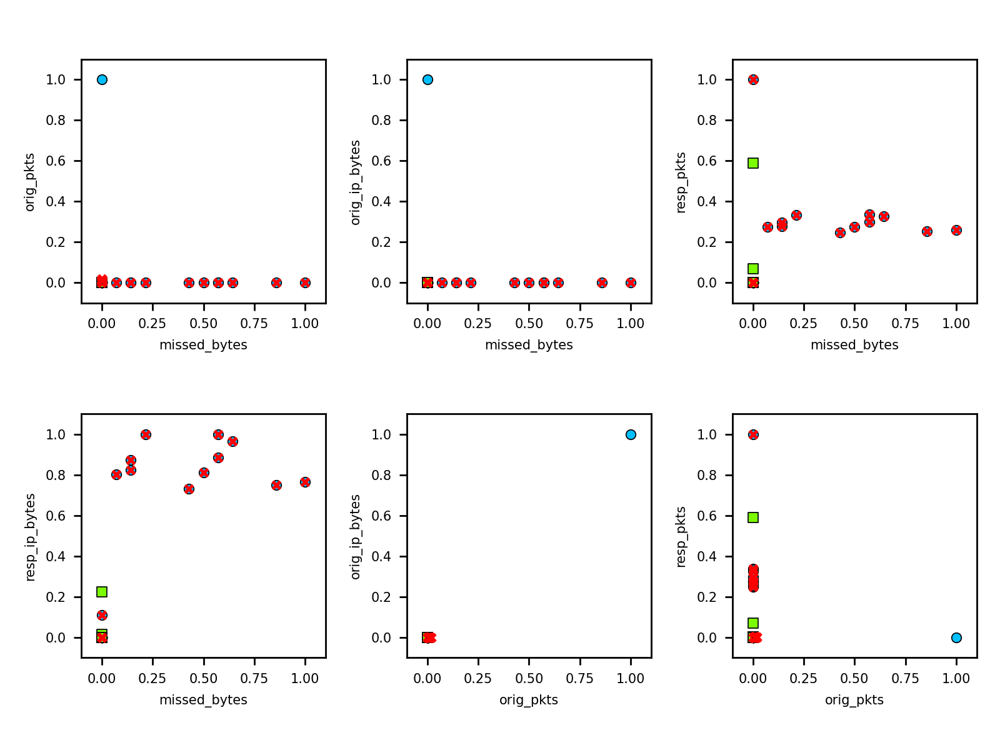

# Adversarial attacks on XGBoost classifier

Adversarial attacks applied to XGBoost classifier.

We use XGBoost [RobustTrees](https://github.com/chenhongge/RobustTrees) classifier implementation.
It must be built locally  [following instructions here](https://github.com/chenhongge/RobustTrees/tree/master/python-package#from-source).

After local build, set up Python environment to use this classifier version:

```
python -m pip install -e "/absolute/local/path/to/RobustTrees/python-package"
```

Then run the attacks using the robust classifier. Per Instructions:

> **Configuration Parameters**
> 
> We added two additional parameters to XGBoost:
> 
> (1) tree_method controls which training method to use. We add a new option `robust_exact` for 
> this parameter. Setting `tree_method = robust_exact` will use our proposed robust training. 
> For other training methods, please refer to XGBoost documentation.
> 
> (2) `robust_eps` is the L inifity perturbation norm (epsilon) used in training. Since the same 
> epsilon value will be applied for all features, it is recommended to normalize your data 
> (e.g., make sure all features are in range 0 - 1). Normalization will not change tree performance
> 
> Please refer to XGBoost Documentation for all other parameters used in XGBoost.

## Run attacks

```
python src/run_attacks.py
```

will run all attacks for robust and non-robust configurations on default dataset. Append path to dataset
to use a different data set:

```
python src/run_attacks.py ./path/to/input_data.csv
```

## Attribute Inference Attack

**Inference attack methods**

- [**Baseline attack**][BL]: Implementation of a baseline attribute inference, not using a model. The idea is to 
    train a simple neural network to learn the attacked feature from the rest of the features. Should be used to 
    compare with other attribute inference results. 

- [**Black box attack**][BB]: Implementation of a simple black-box attribute inference attack. The idea is to train 
    a simple neural network to learn the attacked feature from the rest of the features and the model’s predictions. 
    Assumes the availability of the attacked model’s predictions for the samples under attack, in addition to the rest 
    of the feature values. If this is not available, the true class label of the samples may be used as a proxy. 

- [**Membership attack**][MS]: Implementation of an attribute inference attack that utilizes a membership inference 
    attack. The idea is to find the target feature value that causes the membership inference attack to classify the 
    sample as a member with the highest confidence.

[BL]: https://adversarial-robustness-toolbox.readthedocs.io/en/latest/modules/attacks/inference/attribute_inference.html#attribute-inference-baseline
[BB]: https://adversarial-robustness-toolbox.readthedocs.io/en/latest/modules/attacks/inference/attribute_inference.html#attribute-inference-black-box
[MS]: https://adversarial-robustness-toolbox.readthedocs.io/en/latest/modules/attacks/inference/attribute_inference.html#attribute-inference-membership

Dataset: [CTU-Malware-Capture-44-1](../data/CTU-44-1.csv) (90 / 10 split)

```text
XGBoost ---------------------- v. 0.72 (robust: False)
Read dataset ----------------- data/CTU-44-1.csv
Attributes ------------------- 22
Classes ---------------------- malicious, benign
Training instances ----------- 189
Test instances --------------- 48
Accuracy --------------------- 62.50 %
Precision -------------------- 28.00 %
Recall ----------------------- 100.00 %
F-score ---------------------- 43.75 %
* Inference of attribute proto=udp:
Baseline attack -------------- Accuracy: 98.95 % Precision: 100.00 % Recall: 90.00 %
Black box attack ------------- Accuracy: 98.95 % Precision: 100.00 % Recall: 90.00 %
Membership attack ------------ Accuracy: 94.74 % Precision: 85.71 % Recall: 60.00 %
* Inference of attribute conn_state=SF:
Baseline attack -------------- Accuracy: 98.95 % Precision: 100.00 % Recall: 97.06 %
Black box attack ------------- Accuracy: 98.95 % Precision: 100.00 % Recall: 97.06 %
Membership attack ------------ Accuracy: 35.79 % Precision: 35.79 % Recall: 100.00 %
* Inference of attribute conn_state=S0:
Baseline attack -------------- Accuracy: 98.95 % Precision: 100.00 % Recall: 98.39 %
Black box attack ------------- Accuracy: 100.00 % Precision: 100.00 % Recall: 100.00 %
Membership attack ------------ Accuracy: 65.26 % Precision: 65.26 % Recall: 100.00 %
* Inference of attribute history=ShADadttfF:
Baseline attack -------------- Accuracy: 97.89 % Precision: 100.00 % Recall: 97.83 %
Black box attack ------------- Accuracy: 97.89 % Precision: 100.00 % Recall: 97.83 %
Membership attack ------------ Accuracy: 96.84 % Precision: 96.84 % Recall: 100.00 %
* Inference of attribute history=S:
Baseline attack -------------- Accuracy: 98.95 % Precision: 100.00 % Recall: 98.90 %
Black box attack ------------- Accuracy: 98.95 % Precision: 100.00 % Recall: 98.90 %
Membership attack ------------ Accuracy: 95.79 % Precision: 95.79 % Recall: 100.00 %
* Inference of attribute history=Dd:
Baseline attack -------------- Accuracy: 98.95 % Precision: 100.00 % Recall: 97.44 %
Black box attack ------------- Accuracy: 98.95 % Precision: 100.00 % Recall: 97.44 %
Membership attack ------------ Accuracy: 41.05 % Precision: 41.05 % Recall: 100.00 %
* Inference of attribute history=D:
Baseline attack -------------- Accuracy: 100.00 % Precision: 100.00 % Recall: 100.00 %
Black box attack ------------- Accuracy: 100.00 % Precision: 100.00 % Recall: 100.00 %
Membership attack ------------ Accuracy: 69.47 % Precision: 69.47 % Recall: 100.00 %


XGBoost ---------------------- v. 0.72 (robust: True)
Read dataset ----------------- data/CTU-44-1.csv
Attributes ------------------- 22
Classes ---------------------- malicious, benign
Training instances ----------- 189
Test instances --------------- 48
Accuracy --------------------- 97.92 %
Precision -------------------- 85.71 %
Recall ----------------------- 100.00 %
F-score ---------------------- 92.31 %
* Inference of attribute proto=udp:
Baseline attack -------------- Accuracy: 100.00 % Precision: 100.00 % Recall: 100.00 %
Black box attack ------------- Accuracy: 100.00 % Precision: 100.00 % Recall: 100.00 %
Membership attack ------------ Accuracy: 92.63 % Precision: 100.00 % Recall: 0.00 %
* Inference of attribute conn_state=SF:
Baseline attack -------------- Accuracy: 98.95 % Precision: 100.00 % Recall: 97.06 %
Black box attack ------------- Accuracy: 98.95 % Precision: 100.00 % Recall: 97.06 %
Membership attack ------------ Accuracy: 67.37 % Precision: 71.43 % Recall: 14.71 %
* Inference of attribute conn_state=S0:
Baseline attack -------------- Accuracy: 100.00 % Precision: 100.00 % Recall: 100.00 %
Black box attack ------------- Accuracy: 100.00 % Precision: 100.00 % Recall: 100.00 %
Membership attack ------------ Accuracy: 63.16 % Precision: 64.52 % Recall: 96.77 %
* Inference of attribute history=ShADadttfF:
Baseline attack -------------- Accuracy: 98.95 % Precision: 100.00 % Recall: 98.92 %
Black box attack ------------- Accuracy: 98.95 % Precision: 100.00 % Recall: 98.92 %
Membership attack ------------ Accuracy: 100.00 % Precision: 100.00 % Recall: 100.00 %
* Inference of attribute history=S:
Baseline attack -------------- Accuracy: 100.00 % Precision: 100.00 % Recall: 100.00 %
Black box attack ------------- Accuracy: 100.00 % Precision: 100.00 % Recall: 100.00 %
Membership attack ------------ Accuracy: 95.79 % Precision: 95.79 % Recall: 100.00 %
* Inference of attribute history=Dd:
Baseline attack -------------- Accuracy: 100.00 % Precision: 100.00 % Recall: 100.00 %
Black box attack ------------- Accuracy: 100.00 % Precision: 100.00 % Recall: 100.00 %
Membership attack ------------ Accuracy: 37.89 % Precision: 37.89 % Recall: 100.00 %
* Inference of attribute history=D:
Baseline attack -------------- Accuracy: 100.00 % Precision: 100.00 % Recall: 100.00 %
Black box attack ------------- Accuracy: 100.00 % Precision: 100.00 % Recall: 100.00 %
Membership attack ------------ Accuracy: 69.47 % Precision: 69.47 % Recall: 100.00 %
```

Dataset [CTU-Malware-Capture-20-1](../data/CTU-20-1.csv) (99.5 / 0.5 split)

```
XGBoost ---------------------- v. 0.72 (robust: False)
Read dataset ----------------- data/CTU-20-1.csv
Attributes ------------------- 23
Classes ---------------------- malicious, benign
Training instances ----------- 2567
Test instances --------------- 642
Accuracy --------------------- 100.00 %
Precision -------------------- 100.00 %
Recall ----------------------- 100.00 %
F-score ---------------------- 100.00 %
* Inference of attribute proto=tcp:
Baseline attack -------------- Accuracy: 100.00 % Precision: 100.00 % Recall: 100.00 %
Black box attack ------------- Accuracy: 100.00 % Precision: 100.00 % Recall: 100.00 %
Membership attack ------------ Accuracy: 99.69 % Precision: 99.69 % Recall: 100.00 %
* Inference of attribute conn_state=S0:
Baseline attack -------------- Accuracy: 100.00 % Precision: 100.00 % Recall: 100.00 %
Black box attack ------------- Accuracy: 100.00 % Precision: 100.00 % Recall: 100.00 %
Membership attack ------------ Accuracy: 66.20 % Precision: 66.20 % Recall: 100.00 %
* Inference of attribute conn_state=SF:
Baseline attack -------------- Accuracy: 100.00 % Precision: 100.00 % Recall: 100.00 %
Black box attack ------------- Accuracy: 100.00 % Precision: 100.00 % Recall: 100.00 %
Membership attack ------------ Accuracy: 33.80 % Precision: 33.80 % Recall: 100.00 %
* Inference of attribute history=D:
Baseline attack -------------- Accuracy: 100.00 % Precision: 100.00 % Recall: 100.00 %
Black box attack ------------- Accuracy: 100.00 % Precision: 100.00 % Recall: 100.00 %
Membership attack ------------ Accuracy: 66.51 % Precision: 66.51 % Recall: 100.00 %
* Inference of attribute history=Dd:
Baseline attack -------------- Accuracy: 99.92 % Precision: 100.00 % Recall: 99.77 %
Black box attack ------------- Accuracy: 99.92 % Precision: 100.00 % Recall: 99.77 %
Membership attack ------------ Accuracy: 33.88 % Precision: 33.88 % Recall: 100.00 %
* Inference of attribute history=S:
Baseline attack -------------- Accuracy: 100.00 % Precision: 100.00 % Recall: 100.00 %
Black box attack ------------- Accuracy: 100.00 % Precision: 100.00 % Recall: 100.00 %
Membership attack ------------ Accuracy: 99.69 % Precision: 99.69 % Recall: 100.00 %


XGBoost ---------------------- v. 0.72 (robust: True)
Read dataset ----------------- data/CTU-20-1.csv
Attributes ------------------- 23
Classes ---------------------- malicious, benign
Training instances ----------- 2567
Test instances --------------- 642
Accuracy --------------------- 100.00 %
Precision -------------------- 100.00 %
Recall ----------------------- 100.00 %
F-score ---------------------- 100.00 %
* Inference of attribute proto=tcp:
Baseline attack -------------- Accuracy: 99.92 % Precision: 99.92 % Recall: 100.00 %
Black box attack ------------- Accuracy: 99.92 % Precision: 99.92 % Recall: 100.00 %
Membership attack ------------ Accuracy: 67.13 % Precision: 99.88 % Recall: 67.03 %
* Inference of attribute conn_state=S0:
Baseline attack -------------- Accuracy: 99.92 % Precision: 100.00 % Recall: 99.88 %
Black box attack ------------- Accuracy: 99.92 % Precision: 100.00 % Recall: 99.88 %
Membership attack ------------ Accuracy: 67.13 % Precision: 67.03 % Recall: 99.88 %
* Inference of attribute conn_state=SF:
Baseline attack -------------- Accuracy: 100.00 % Precision: 100.00 % Recall: 100.00 %
Black box attack ------------- Accuracy: 100.00 % Precision: 100.00 % Recall: 100.00 %
Membership attack ------------ Accuracy: 33.33 % Precision: 33.33 % Recall: 100.00 %
* Inference of attribute history=D:
Baseline attack -------------- Accuracy: 100.00 % Precision: 100.00 % Recall: 100.00 %
Black box attack ------------- Accuracy: 100.00 % Precision: 100.00 % Recall: 100.00 %
Membership attack ------------ Accuracy: 67.21 % Precision: 67.21 % Recall: 100.00 %
* Inference of attribute history=Dd:
Baseline attack -------------- Accuracy: 100.00 % Precision: 100.00 % Recall: 100.00 %
Black box attack ------------- Accuracy: 100.00 % Precision: 100.00 % Recall: 100.00 %
Membership attack ------------ Accuracy: 33.33 % Precision: 33.33 % Recall: 100.00 %
* Inference of attribute history=S:
Baseline attack -------------- Accuracy: 99.92 % Precision: 100.00 % Recall: 99.92 %
Black box attack ------------- Accuracy: 99.92 % Precision: 100.00 % Recall: 99.92 %
Membership attack ------------ Accuracy: 99.53 % Precision: 99.53 % Recall: 100.00 %
```

## ZOO Evasion attack

Applying Zeroth-Order Optimization (ZOO) Attack:

- blue circles: malicious training 
- green circles: benign training 
- red crosses: adversarial modified instance
- black line: difference between original and adversarial

Dataset: [CTU-Malware-Capture-44-1](../data/CTU-44-1.csv) (90 / 10 split)

| Non-Robust XGBoost       | Robust XGBoost       |
|--------------------------|----------------------|
|  |  |
|  |  |
|  |  |
|  |  |


 
