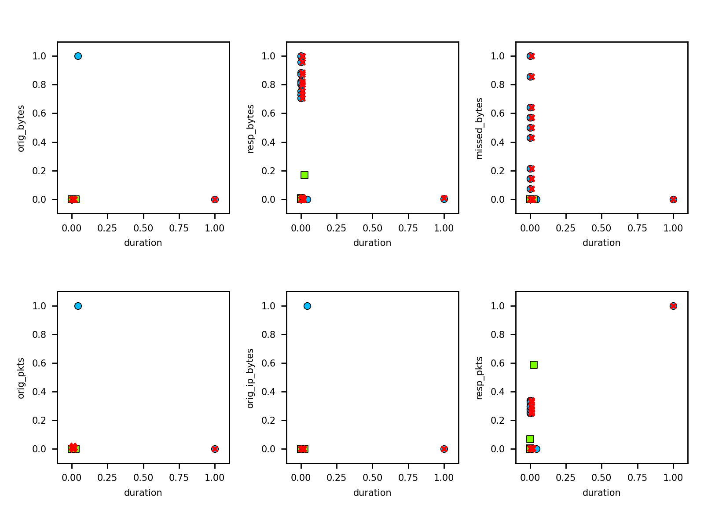
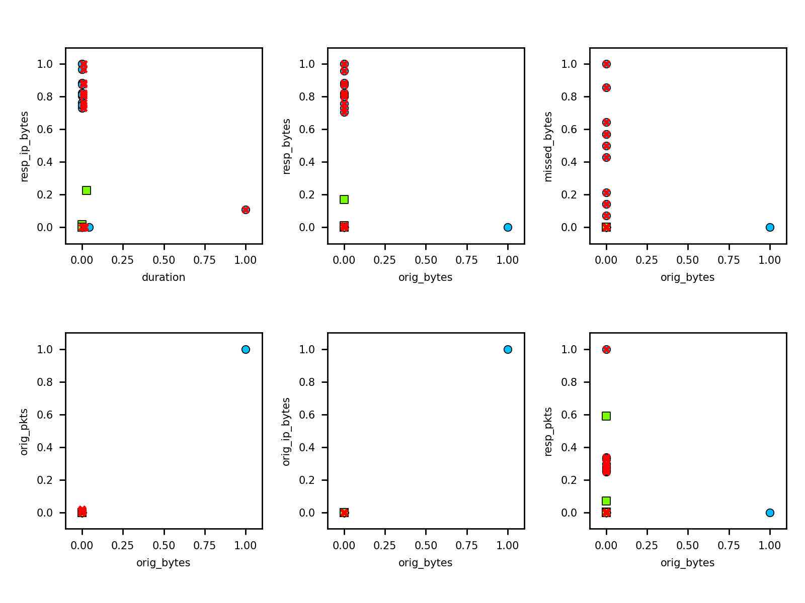
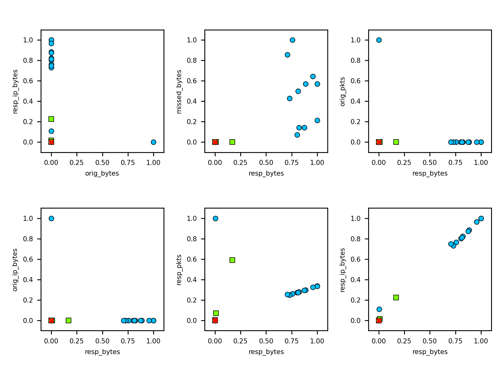
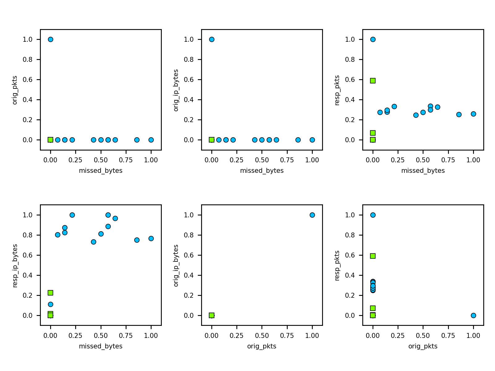

# Adversarial attacks on XGBoost classifier

Adversarial attacks applied to XGBoost classifier.

#### Non-robust XGBoost Attribute Inference

```text
python src/attack_inf.py
Read dataset ----------------- data/CTU-44-1.csv
Attributes ------------------- 22
Classes ---------------------- malicious, benign
Training instances ----------- 177
Test instances --------------- 60
Split (benign) --------------- 30.51 %
Accuracy --------------------- 98.33 %
Precision -------------------- 85.71 %
Recall ----------------------- 100.00 %
F-score ---------------------- 92.31 %
* Inference of attribute proto=udp:
Baseline attack -------------- Accuracy: 98.88 % Precision: 100.00 % Recall: 90.00 %
Black box attack ------------- Accuracy: 98.88 % Precision: 100.00 % Recall: 90.00 %
Membership attack ------------ Accuracy: 11.24 % Precision: 11.24 % Recall: 100.00 %
* Inference of attribute conn_state=SF:
Baseline attack -------------- Accuracy: 98.88 % Precision: 100.00 % Recall: 96.77 %
Black box attack ------------- Accuracy: 98.88 % Precision: 100.00 % Recall: 96.77 %
Membership attack ------------ Accuracy: 34.83 % Precision: 34.83 % Recall: 100.00 %
* Inference of attribute conn_state=S0:
Baseline attack -------------- Accuracy: 98.88 % Precision: 100.00 % Recall: 98.31 %
Black box attack ------------- Accuracy: 98.88 % Precision: 100.00 % Recall: 98.31 %
Membership attack ------------ Accuracy: 66.29 % Precision: 66.29 % Recall: 100.00 %
* Inference of attribute history=ShADadttfF:
Baseline attack -------------- Accuracy: 98.88 % Precision: 100.00 % Recall: 98.82 %
Black box attack ------------- Accuracy: 98.88 % Precision: 100.00 % Recall: 98.82 %
Membership attack ------------ Accuracy: 95.51 % Precision: 95.51 % Recall: 100.00 %
* Inference of attribute history=S:
Baseline attack -------------- Accuracy: 100.00 % Precision: 100.00 % Recall: 100.00 %
Black box attack ------------- Accuracy: 100.00 % Precision: 100.00 % Recall: 100.00 %
Membership attack ------------ Accuracy: 95.51 % Precision: 95.51 % Recall: 100.00 %
* Inference of attribute history=Dd:
Baseline attack -------------- Accuracy: 98.88 % Precision: 100.00 % Recall: 97.22 %
Black box attack ------------- Accuracy: 98.88 % Precision: 100.00 % Recall: 97.22 %
Membership attack ------------ Accuracy: 40.45 % Precision: 40.45 % Recall: 100.00 %
* Inference of attribute history=D:
Baseline attack -------------- Accuracy: 100.00 % Precision: 100.00 % Recall: 100.00 %
Black box attack ------------- Accuracy: 100.00 % Precision: 100.00 % Recall: 100.00 %
Membership attack ------------ Accuracy: 70.79 % Precision: 70.79 % Recall: 100.00 %
```

**Inference attack methods**

- [**Baseline attack**][BL]: Implementation of a baseline attribute inference, not using a model. The idea is to 
    train a simple neural network to learn the attacked feature from the rest of the features. Should be used to 
    compare with other attribute inference results. 

- [**Black box attack**][BB]: Implementation of a simple black-box attribute inference attack. The idea is to train 
    a simple neural network to learn the attacked feature from the rest of the features and the model’s predictions. 
    Assumes the availability of the attacked model’s predictions for the samples under attack, in addition to the rest 
    of the feature values. If this is not available, the true class label of the samples may be used as a proxy. 

- [**Membership attack**][MS]: Implementation of an attribute inference attack that utilizes a membership inference 
    attack. The idea is to find the target feature value that causes the membership inference attack to classify the 
    sample as a member with the highest confidence.


#### Non-robust XGBoost ZOO Evasion attack

Applying Zeroth-Order Optimization (ZOO) Attack:

- blue circles: malicious training 
- green circles: benign training 
- red crosses: adversarial modified instance
- black line: difference between original and adversarial

 

 

 

 