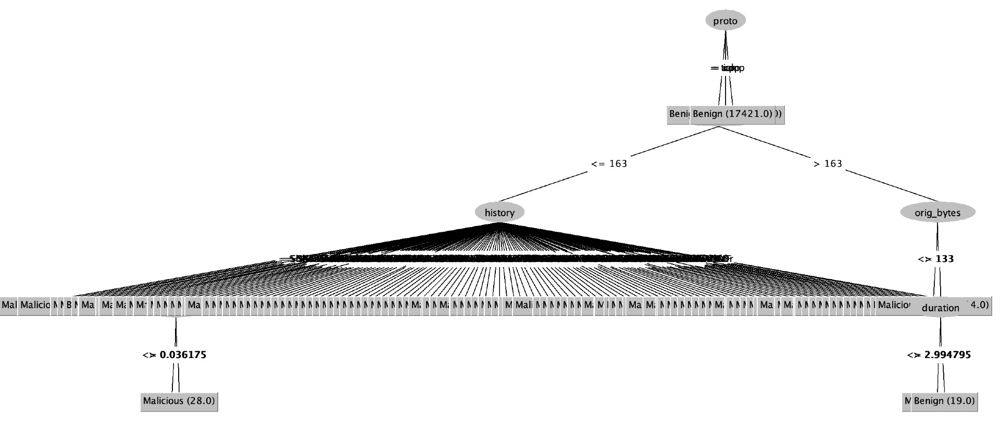

# IoT-23 Training logs

These are logged prediction results of training on Aposemat IoT-23 dataset.

**Classifiers:** AdaBoost, ann, naive bayes, SVM, decision tree.

**12 attributes:** proto, duration, orig_bytes, resp_bytes, conn_state,
missed_bytes, history, orig_pkts, orig_ip_bytes, resp_pkts, resp_ip_bytes,
label.

**validation:** 10-folds cross-validation.

## Malware Capture 20-1 (benign)

CTU Malware Capture 20-1 is a highly benign dataset.

| Datasets                      |       | Benign | Malicious |      Ratio | 
|-------------------------------|:------|:------:|:---------:|-----------:|
| [CTU-Malware-Capture-20-1][1] | Train |  3193  |    16     | 99.5 / 0.5 |
| [Honeypot-7][4]               | Test  |  120   |     0     |    100 / 0 |
| [CTU-Malware-Capture-44-1][2] | Test  |  211   |    26     |    90 / 10 | 

**Accuracy**

| Method               |  Training | Honeypot-7 (All Benign) | Malware-44 (Mostly Benign) |
|:---------------------|----------:|----------------------------:|-------------------------------:|
| [Adaboost][AB0]      | 99.9377 % |                       100 % |                      94.8498 % |
| [ANN][AN0]           | 30.1963 % |                         0 % |                      10.7296 % |
| [Decision tree][DT0] | 99.9688 % |                   92.7419 % |                      98.7124 % |
| [Naive Bayes][NB0]   | 99.3768 % |                   56.4516 % |                      93.9914 % |
| [SVM][SV0]           | 99.9377 % |                       100 % |                          100 % |

  

**Decision tree**

  

## Malware Capture 34-1 (malicious)

CTU Malware Capture 34-1 is a highly malicious dataset.

| Datasets                      |       | Benign | Malicious |   Ratio | 
|-------------------------------|-------|:------:|:---------:|--------:|
| [CTU-Malware-Capture-34-1][3] | Train |  1923  |   21222   |  8 / 92 |
| [Honeypot-7][4]               | Test  |  120   |     0     | 100 / 0 |
| [CTU-Malware-Capture-44-1][2] | Test  |  211   |    26     | 90 / 10 |

**Accuracy**

| Method               |  Training | Honeypot-7 (All Benign) | Malware-44 (Mostly Benign) |
|:---------------------|----------:|----------------------------:|-------------------------------:|
| [Adaboost][AB1]      | 99.5118 % |                   56.4516 % |                      98.7124 % |
| [ANN][AN1]           | 91.8859 % |                   10.4839 % |                       6.4378 % |
| [Decision tree][DT1] | 99.5766 % |                   56.4516 % |                      94.4206 % |
| [Naive Bayes][NB1]   | 99.5463 % |                   48.3871 % |                       95.279 % |
| [SVM][SV1]           | 99.5723 % |                   54.8387 % |                      94.8498 % |  

**Decision tree**

## Malware Capture 1-1: 50/50 split

Goal: train on 50/50 split data; test on both highly benign and malicious data.

**Training set**: CTU-IoT-Malware-Capture-1-1 (Hide and Seek)

- Original: [https://mcfp.felk.cvut.cz/.../CTU-IoT-Malware-Capture-1-1][8]
- Preprocessed: [CTU-IoT-Malware-Capture-1-1.csv][6]
- Sampled, 25% with replacement: [CTU-IoT-Malware-Capture-1-1-sampled.csv][7]
- ANN and SVM were trained on sampled data

**Datasets**

| Dataset name                     |       | Benign | Malicious |     Ratio | 
|:---------------------------------|-------|:------:|:---------:|----------:|
| [CTU-IoT-Malware-Capture-1-1][6] | Train | 469275 |  539473   | 46.5/53.5 |
| [Honeypot-7][4]                  | Test  |  130   |     0     |   100 / 0 |
| [CTU-Malware-Capture-44-1][2]    | Test  |  211   |    26     |   90 / 10 |
| [CTU-Malware-Capture-34-1][3]    | Test  |  1923  |   21222   |    8 / 92 |

## Accuracy

| Method               | Training (50/50) | Honeypot-7 (All Benign) | Malware-44 (Mostly Benign) | Malware-34 (Mostly Malicious) |
|:---------------------|---------------------:|----------------------------:|-------------------------------:|----------------------------------:|
| [Adaboost][AB2]      |             95.665 % |                   92.7419 % |                      98.7124 % |                         61.4754 % |
| [ANN][AN2]           |            95.2777 % |                   89.5161 % |                      98.7124 % |                         61.4754 % |
| [Decision tree][DT2] |            95.6873 % |                   92.7419 % |                      99.5708 % |                         63.1148 % |
| [Naive Bayes][NB2]   |            63.7226 % |                   23.3871 % |                      90.5579 % |                         69.6721 % |
| [SVM][SV2]           |            95.6782 % |                   92.7419 % |                      98.7124 % |                         61.4754 % |  

**Decision tree**

[1]: https://github.com/iotcad/sensor-data/blob/611d9ff5e768c74fc8a5f7ea2ef52a974b85eeae/iot-23/CTU-Malware-Capture-20-1-labeled.csv

[2]: https://github.com/iotcad/sensor-data/blob/611d9ff5e768c74fc8a5f7ea2ef52a974b85eeae/iot-23/CTU-Malware-Capture-44-1-labeled.csv

[3]: https://github.com/iotcad/sensor-data/blob/611d9ff5e768c74fc8a5f7ea2ef52a974b85eeae/iot-23/CTU-Malware-Capture-34-1-labeled.csv

[4]: https://github.com/iotcad/sensor-data/blob/611d9ff5e768c74fc8a5f7ea2ef52a974b85eeae/iot-23/CTU-Honeypot-Capture-7-1-labeled.csv

[5]: https://github.com/iotcad/sensor-data/blob/de0d85ec49f0e3560e2715abe5d7fcb48194be24/iot-23/CTU-Malware-Capture-8-1-labeled.csv

[6]: https://github.com/iotcad/sensor-data/blob/0412e9b52bed951f7a1283e2b08ea52f78cc90ba/iot-23/12-attr/CTU-IoT-Malware-Capture-1-1.csv

[7]: https://github.com/iotcad/sensor-data/blob/de0d85ec49f0e3560e2715abe5d7fcb48194be24/iot-23/12-attr/CTU-IoT-Malware-Capture-1-1-sampled.csv

[8]: https://mcfp.felk.cvut.cz/publicDatasets/IoT-23-Dataset/IndividualScenarios/CTU-IoT-Malware-Capture-1-1

[AB0]: logs/20-1-adaboost

[AN0]: logs/20-1-ann

[DT0]: logs/20-1-tree

[NB0]: logs/20-1-bayes

[SV0]: logs/20-1-svm

[AB1]: logs/34-1-adaboost

[AN1]: logs/34-1-ann

[DT1]: logs/34-1-tree

[NB1]: logs/34-1-bayes

[SV1]: logs/34-1-svm

[NB2]: logs/1-1-bayes

[DT2]: logs/1-1-tree

[SV2]: logs/1-1-svm

[AN2]: logs/1-1-ann

[AB2]: logs/1-1-adaboost
