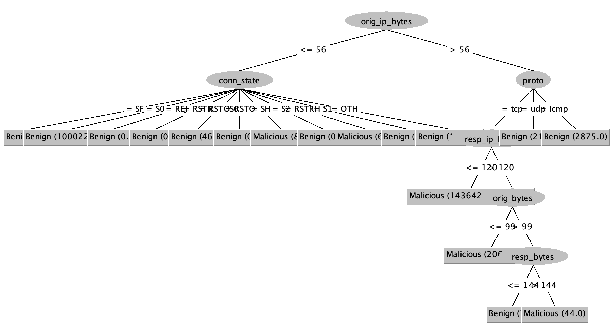

# IoT-23 Training logs

These are logged prediction results of training on Aposemat IoT-23 dataset.

**Classifiers:** AdaBoost, ann, naive bayes, SVM, decision tree.

**12 attributes:** proto, duration, orig_bytes, resp_bytes, conn_state,
missed_bytes, history, orig_pkts, orig_ip_bytes, resp_pkts, resp_ip_bytes,
label.

**validation:** 10-folds cross-validation.

| Test datasets                 | Benign | Malicious |   Ratio | 
|:------------------------------|:------:|:---------:|--------:|
| [CTU-Honeypot-Capture-7-1][4] |  120   |     0     | 100 / 0 |
| [CTU-Malware-Capture-44-1][2] |  211   |    26     | 90 / 10 | 
| [CTU-Malware-Capture-8-1][5]  | 2181	  |   8222    | 20 / 80 | 

## Malware Capture 20-1 (benign)

| Datasets                      |       | Benign | Malicious |      Ratio | 
|:------------------------------|:------|:------:|:---------:|-----------:|
| [CTU-Malware-Capture-20-1][1] | Train |  3193  |    16     | 99.5 / 0.5 |

**Accuracy**

| Method               | Training Benign | Honeypot-7 (All Benign) | Malware-44 (Mostly Benign) | Malware-8 (Mostly Malicious) |
|:---------------------|--------------------:|----------------------------:|-------------------------------:|---------------------------------:|
| [Adaboost][AB0]      |           99.9377 % |                   99.2308 % |                      94.5148 % |                       100.0000 % |
| [ANN][AN0]           |           30.1963 % |                         0 % |                      10.9705 % |                        79.0349 % |
| [Decision tree][DT0] |           99.9688 % |                   92.3077 % |                      98.7342 % |                        99.9808 % |
| [Naive Bayes][NB0]   |           99.3768 % |                   55.3846 % |                      94.0928 % |                        20.9459 % |
| [SVM][SV0]           |           99.9377 % |                   99.2308 % |                      99.5781 % |                       100.0000 % |

**Decision tree**

  

## Malware Capture 34-1 (malicious)

| Datasets                      |       | Benign | Malicious |   Ratio | 
|-------------------------------|-------|:------:|:---------:|--------:|
| [CTU-Malware-Capture-34-1][3] | Train |  1923  |   21222   |  8 / 92 |

**Accuracy**

| Method               | Training Malicious | Honeypot-7 (All Benign) | Malware-44 (Mostly Benign) | Malware-8 (Mostly Malicious) |
|:---------------------|-----------------------:|----------------------------:|-------------------------------:|---------------------------------:|
| [Adaboost][AB1]      |              99.5118 % |                   54.6154 % |                      98.7342 % |                        99.9808 % |
| [ANN][AN1]           |              91.8859 % |                   10.7692 % |                       6.7511 % |                        79.0349 % |
| [Decision tree][DT1] |              99.5766 % |                   54.6154 % |                      94.5148 % |                        99.9808 % |
| [Naive Bayes][NB1]   |              99.5463 % |                   46.9231 % |                      94.9367 % |                        99.9808 % |
| [SVM][SV1]           |              99.5723 % |                   53.8462 % |                      94.9367 % |                        99.9808 % |

**Decision tree**

  

## Malware Capture 1-1: 50/50 split

| Dataset name                     | Benign | Malicious |         Ratio | 
|:---------------------------------|:------:|:---------:|--------------:|
| [CTU-IoT-Malware-Capture-1-1][6] | 117318 |  134868   |   46.5 / 53.5 |

**Accuracy**

| Method               | Training (50/50) | Honeypot-7 (All Benign) | Malware-44 (Mostly Benign) | Malware-8 (Mostly Malicious) |
|:---------------------|---------------------:|----------------------------:|-------------------------------:|---------------------------------:|
| [Adaboost][AB2]      |            95.6528 % |                   92.3077 % |                      98.7342 % |                        99.9808 % |
| [ANN][AN2]           |            95.2777 % |                   89.2308 % |                      98.7342 % |                        99.9808 % |
| [Decision tree][DT2] |            95.6726 % |                   99.2308 % |                      98.7342 % |                       100.0000 % |
| [Naive Bayes][NB2]   |            63.7323 % |                   25.3846 % |                      90.7173 % |                        40.7094 % |
| [SVM][SV2]           |            95.6782 % |                   92.7419 % |                      98.7124 % |                        61.4754 % |

**Decision tree**

[1]: https://github.com/iotcad/sensor-data/blob/611d9ff5e768c74fc8a5f7ea2ef52a974b85eeae/iot-23/CTU-Malware-Capture-20-1-labeled.csv
[2]: https://github.com/iotcad/sensor-data/blob/611d9ff5e768c74fc8a5f7ea2ef52a974b85eeae/iot-23/CTU-Malware-Capture-44-1-labeled.csv
[3]: https://github.com/iotcad/sensor-data/blob/611d9ff5e768c74fc8a5f7ea2ef52a974b85eeae/iot-23/CTU-Malware-Capture-34-1-labeled.csv
[4]: https://github.com/iotcad/sensor-data/blob/611d9ff5e768c74fc8a5f7ea2ef52a974b85eeae/iot-23/CTU-Honeypot-Capture-7-1-labeled.csv
[5]: https://github.com/iotcad/sensor-data/blob/de0d85ec49f0e3560e2715abe5d7fcb48194be24/iot-23/CTU-Malware-Capture-8-1-labeled.csv
[6]: https://github.com/iotcad/sensor-data/blob/de0d85ec49f0e3560e2715abe5d7fcb48194be24/iot-23/12-attr/CTU-IoT-Malware-Capture-1-1-sampled.csv

[AB0]: logs/20-1-adaboost
[AN0]: logs/20-1-ann
[DT0]: logs/20-1-tree
[NB0]: logs/20-1-bayes
[SV0]: logs/20-1-svm
[AB1]: logs/34-1-adaboost
[AN1]: logs/34-1-ann
[DT1]: logs/34-1-tree
[NB1]: logs/34-1-bayes
[SV1]: logs/34-1-svm
[NB2]: logs/1-1-bayes
[DT2]: logs/1-1-tree
[SV2]: logs/1-1-svm
[AN2]: logs/1-1-ann
[AB2]: logs/1-1-adaboost
