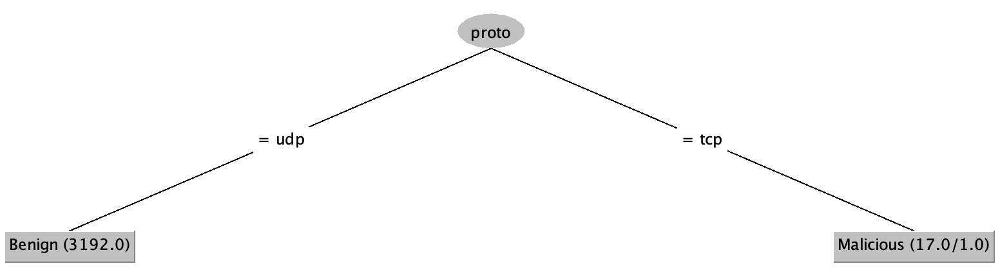
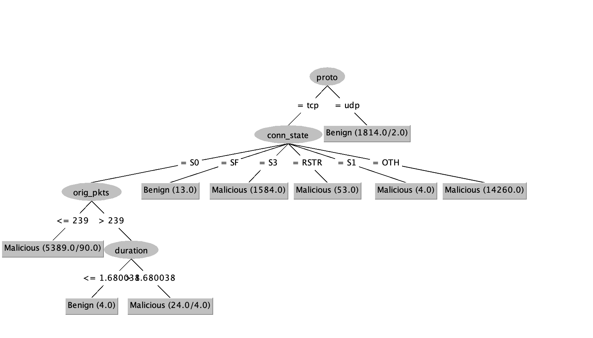

# IoT-23 Training logs

These are logged prediction results of training on Aposemat IoT-23 dataset.

Evaluated on these algorithms: AdaBoost, ann, naive bayes, SVM, decision tree.

12 attributes: Proto, duration, orig_bytes, resp_bytes, conn_state, 
missed_bytes, history, orig_pkts, orig_ip_bytes, resp_pkts, resp_ip_bytes, 
label.

using 10-folds cross-validation.

## 20-1 logs

Train on CTU Malware Capture 20-1 (highly benign).

Test on Honeypot-7 and Malware-Capture-44.

|                               | Benign | Malicious |      Ratio | 
|-------------------------------|:------:|:---------:|-----------:|
| [CTU-Malware-Capture-20-1][1] |  3193  |    16     | 99.5 / 0.5 |
| [CTU-Malware-Capture-44-1][2] |  211   |    26     |    90 / 10 |
| [Honeypot-7][4]               |  120   |     0     |    100 / 0 |

**Accuracy**

| Method               |  Training | Honeypot-7 | Malware-44 |
|:---------------------|----------:|-----------:|-----------:|
| [Adaboost][AB0]      | 99.9377 % |      100 % |  94.8498 % |
| [ANN][AN0]           | 30.1963 % |        0 % |  10.7296 % |
| [Decision tree][DT0] | 99.9688 % |  92.7419 % |  98.7124 % |
| [Naive Bayes][NB0]   | 99.3768 % |  56.4516 % |  93.9914 % |
| [SVM][SV0]           | 99.9377 % |      100 % |      100 % |  

## 34-1 logs

Train on CTU Malware Capture 34-1 (highly malicious).

Test on Honeypot-7 and Malware-Capture-44.

|                               | Benign | Malicious |   Ratio | 
|-------------------------------|:------:|:---------:|--------:|
| [CTU-Malware-Capture-34-1][3] |  1923  |   21222   |  8 / 92 |
| [CTU-Malware-Capture-44-1][2] |  211   |    26     | 90 / 10 |
| [Honeypot-7][4]               |  120   |     0     | 100 / 0 |

**Accuracy**

| Method               |  Training | Honeypot-7 | Malware-44 |
|:---------------------|----------:|-----------:|-----------:|
| [Adaboost][AB1]      | 99.5118 % |  56.4516 % |  98.7124 % |
| [ANN][AN1]           | 91.8859 % |  10.4839 % |   6.4378 % |
| [Decision tree][DT1] | 99.5766 % |  56.4516 % |  94.4206 % |
| [Naive Bayes][NB1]   | 99.5463 % |  48.3871 % |   95.279 % |
| [SVM][SV1]           | 99.5723 % |  54.8387 % |  94.8498 % |  

**Decision tree**

[1]: https://github.com/iotcad/sensor-data/blob/611d9ff5e768c74fc8a5f7ea2ef52a974b85eeae/iot-23/CTU-Malware-Capture-20-1-labeled.csv
[2]: https://github.com/iotcad/sensor-data/blob/611d9ff5e768c74fc8a5f7ea2ef52a974b85eeae/iot-23/CTU-Malware-Capture-44-1-labeled.csv
[3]: https://github.com/iotcad/sensor-data/blob/611d9ff5e768c74fc8a5f7ea2ef52a974b85eeae/iot-23/CTU-Malware-Capture-34-1-labeled.csv
[4]: https://github.com/iotcad/sensor-data/blob/611d9ff5e768c74fc8a5f7ea2ef52a974b85eeae/iot-23/CTU-Honeypot-Capture-7-1-labeled.csv
[AB0]: 20-1-adaboost
[AN0]: 20-1-ann
[DT0]: 20-1-tree
[NB0]: 20-1-bayes
[SV0]: 20-1-svm
[AB1]: 34-1-adaboost
[AN1]: 34-1-ann
[DT1]: 34-1-tree
[NB1]: 34-1-bayes
[SV1]: 34-1-svm
