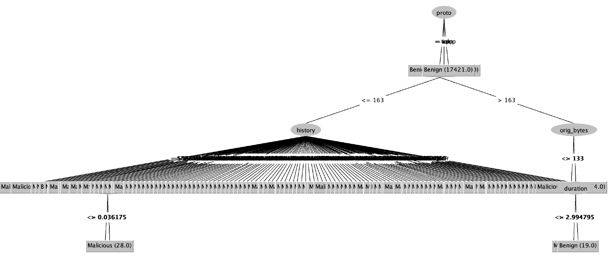

# IoT-23 50/50 split test

These are logged results of training on Aposemat IoT-23 dataset.

Goal: train on 50/50 split data

- test on highly benign data
- test on highly malicious data

What is the prediction accuracy in these scenarios? 

(compare to [previous results](../2-24))
 
**Training set**: CTU-IoT-Malware-Capture-1-1 (Hide and Seek)

- Original: [https://mcfp.felk.cvut.cz/.../CTU-IoT-Malware-Capture-1-1][1]
- Preprocessed: [CTU-IoT-Malware-Capture-1-1.csv][2a]
- Sampled, 25% with replacement: [CTU-IoT-Malware-Capture-1-1-sampled.csv][2b]

| Label     |  Flows | Ratio  |
|:----------|-------:|:------:|
| Benign    | 469275 | 46.5 % |
| Malicious | 539473 | 53.5 % |

12 attributes: proto, duration, orig_bytes, resp_bytes, conn_state, 
missed_bytes, history, orig_pkts, orig_ip_bytes, resp_pkts, resp_ip_bytes, 
label

**Tests**

| Test                          | Benign | Malicious |   Ratio | 
|-------------------------------|:------:|:---------:|--------:|
| [Honeypot-7][4]               |  130   |     0     | 100 / 0 |
| [CTU-Malware-Capture-44-1][3] |  211   |    26     | 90 / 10 |
| [CTU-Malware-Capture-34-1][5] |  1923  |   21222   |  8 / 92 |

## Accuracy

| Method              |  Training | Honeypot-7 (All Benign) | Malware-44 (Mostly Benign) | Malware-34 (Mostly Malicious) |
|:--------------------|----------:|----------------------------:|-------------------------------:|----------------------------------:|
| [Adaboost][AB]      |  95.665 % |                   92.7419 % |                      98.7124 % |                         61.4754 % |
| [ANN][AN]           | 95.2777 % |                   89.5161 % |                      98.7124 % |                         61.4754 % |
| [Decision tree][DT] | 95.6873 % |                   92.7419 % |                      99.5708 % |                         63.1148 % |
| [Naive Bayes][NB]   | 63.7226 % |                   23.3871 % |                      90.5579 % |                         69.6721 % |
| [SVM][SV]           | 95.6782 % |                   92.7419 % |                      98.7124 % |                         61.4754 % |  

ANN and SVM were trained on sampled data 

**Decision tree**

[1]: https://mcfp.felk.cvut.cz/publicDatasets/IoT-23-Dataset/IndividualScenarios/CTU-IoT-Malware-Capture-1-1
[2a]: https://github.com/iotcad/sensor-data/blob/0412e9b52bed951f7a1283e2b08ea52f78cc90ba/iot-23/12-attr/CTU-IoT-Malware-Capture-1-1.csv
[2b]: https://github.com/iotcad/sensor-data/blob/de0d85ec49f0e3560e2715abe5d7fcb48194be24/iot-23/12-attr/CTU-IoT-Malware-Capture-1-1-sampled.csv
[3]: https://github.com/iotcad/sensor-data/blob/0412e9b52bed951f7a1283e2b08ea52f78cc90ba/iot-23/12-attr/CTU-Malware-Capture-44-1-labeled.csv
[4]: https://github.com/iotcad/sensor-data/blob/0412e9b52bed951f7a1283e2b08ea52f78cc90ba/iot-23/12-attr/CTU-Honeypot-Capture-7-1-labeled.csv
[5]: https://github.com/iotcad/sensor-data/blob/0412e9b52bed951f7a1283e2b08ea52f78cc90ba/iot-23/12-attr/CTU-Malware-Capture-34-1-labeled.csv
[NB]: bayes
[DT]: tree
[SV]: svm
[AN]: ann
[AB]: adaboost
