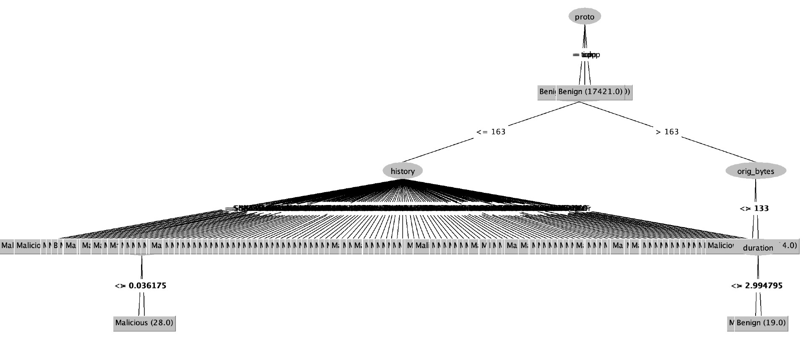

# Training logs

These are logged results of training on Aposemat IoT-23 dataset.

Goal: train on 50/50 split data

- test on highly benign data
- test on highly malicious data

What is the prediction accuracy in these scenarios (compared to [previous results](../2-24/readme.md))?
 
**Training set**: CTU-IoT-Malware-Capture-1-1 (Hide and Seek)

- Source: [https://mcfp.felk.cvut.cz/.../CTU-IoT-Malware-Capture-1-1][1]
- Preprocessed: [CTU-IoT-Malware-Capture-1-1.csv][2]

| Label     | Flows   | Ratio   |
| :-------- | ------: | :-----: |
| Benign    | 469275  |  46.5 % |
| Malicious | 539473  |  53.5 % |

12 attributes:

Proto, duration, orig_bytes, resp_bytes, conn_state, missed_bytes, history, orig_pkts, orig_ip_bytes, resp_pkts, 
resp_ip_bytes, label

**Tests**

- Test: [CTU-Malware-Capture-44-1][3]: benign: 211, malicious: 26 
- Test: [Honeypot-7][4]: benign: 130, malicious: 0

## Accuracy

| Method              | Training    | Honeypot-7 | Malware-44 |
| :------------------ | ----------: | ---------: | ---------: |
| [Adaboost][AB]      |             |            |            |
| [ANN][AN]           |             |            |            |
| [Decision tree][DT] |   95.6873 % |  92.7419 % |  99.5708 % |
| [Naive Bayes][NB]   |   63.7226 % |  23.3871 % |  90.5579 % |
| [SVM][SV]           |             |            |            |  

Decision tree

[1]: https://mcfp.felk.cvut.cz/publicDatasets/IoT-23-Dataset/IndividualScenarios/CTU-IoT-Malware-Capture-1-1
[2]: https://github.com/iotcad/module-2/blob/44967f3e6aa6288a4eb806face3bf21686f89851/data/CTU-IoT-Malware-Capture-1-1.csv
[3]: https://github.com/iotcad/sensor-data/blob/611d9ff5e768c74fc8a5f7ea2ef52a974b85eeae/iot-23/CTU-Malware-Capture-44-1-labeled.csv
[4]: https://github.com/iotcad/sensor-data/blob/611d9ff5e768c74fc8a5f7ea2ef52a974b85eeae/iot-23/CTU-Honeypot-Capture-7-1-labeled.csv
[NB]: naive-bayes
[DT]: tree
[SV]: svm
[AN]: ann
[AB]: adaboost