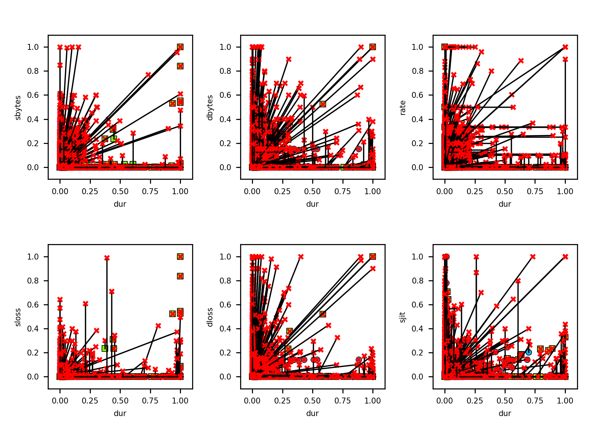
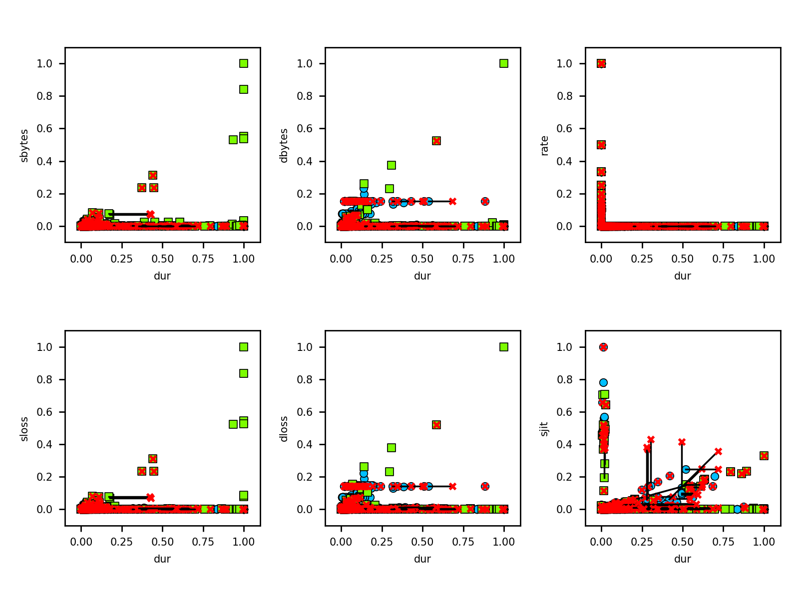

# Adversarial attacks on XGBoost classifier

We use XGBoost [RobustTrees](https://github.com/chenhongge/RobustTrees) classifier implementation.
It must be built locally  [following instructions here](https://github.com/chenhongge/RobustTrees/tree/master/python-package#from-source).

## Attacks

### ZOO Evasion attack

Applying Zeroth-Order Optimization (ZOO) Attack:

- blue circles: malicious training 
- green circles: benign training 
- red crosses: adversarial modified instance
- black line: difference between original and adversarial

#### Results: IoT-23

Dataset: [CTU-Malware-Capture-1-1](../../data/CTU-1-1.csv)

```
Read dataset ----------------- data/CTU-1-1.csv
Attributes ------------------- 16
Classifier ------------------- XGBoost, robust: False
Classes ---------------------- benign, malicious
Training split --------------- 50.0/50.0
Training instances ----------- 10000
Test instances --------------- 0
Accuracy --------------------- 95.25 %
Precision -------------------- 100.00 %
Recall ----------------------- 90.50 %
F-score ---------------------- 95.01 %
Evasion success -------------- 4526 (45.26 %)


Read dataset ----------------- data/CTU-1-1.csv
Attributes ------------------- 16
Classifier ------------------- XGBoost, robust: True
Classes ---------------------- benign, malicious
Training split --------------- 50.0/50.0
Training instances ----------- 10000
Test instances --------------- 0
Accuracy --------------------- 95.25 %
Precision -------------------- 100.00 %
Recall ----------------------- 90.50 %
F-score ---------------------- 95.01 %
Evasion success -------------- 4525 (45.25 %)
```

| **Non-Robust XGBoost**     |
|:---------------------------|
|  |
| **Robust XGBoost**         |
|      |


#### Results: UNSW-NB15

Dataset: [UNSW-NB15 1 (sampled)](../../data/nb15-1-1.csv)

```
Read dataset ----------------- data/nb15-10K.csv
Attributes ------------------- 33
Classifier ------------------- XGBoost, robust: False
Classes ---------------------- benign, malicious
Training split --------------- 50.0/50.0
Training instances ----------- 10000
Test instances --------------- 0
Accuracy --------------------- 96.02 %
Precision -------------------- 95.49 %
Recall ----------------------- 96.60 %
F-score ---------------------- 96.04 %
Evasion success -------------- 9920 (99.20 %)


Read dataset ----------------- data/nb15-10K.csv
Attributes ------------------- 33
Classifier ------------------- XGBoost, robust: True
Classes ---------------------- benign, malicious
Training split --------------- 50.0/50.0
Training instances ----------- 10000
Test instances --------------- 0
Accuracy --------------------- 82.46 %
Precision -------------------- 80.48 %
Recall ----------------------- 85.70 %
F-score ---------------------- 83.01 %
Evasion success -------------- 4556 (45.56 %)
```

| **Non-Robust XGBoost**    |
|:--------------------------|
|  |
| **Robust XGBoost**        |
|      |


### HopSkipJump Attack


**Results**

```
Read dataset ----------------- data/CTU-1-1.csv
Attributes ------------------- 19
Classifier ------------------- XGBoost, robust: False
Classes ---------------------- benign, malicious
Training split --------------- 53.2/46.8
Training instances ----------- 12609
Test instances --------------- 0
Accuracy --------------------- 95.86 %
Precision -------------------- 100.00 %
Recall ----------------------- 91.15 %
F-score ---------------------- 95.37 %
--------------------------------------------------
HOPSKIPJUMP ATTACK
--------------------------------------------------
Success rate ----------------- 100.00
Error min/max ---------------- 0.022092 - 0.667910
mutations: ------------------- 18 attributes
conn_state=OTH :: conn_state=RSTR :: proto=icmp :: orig_pkts :: conn_state=SH :: resp_ip_bytes :: resp_bytes :: conn_state=REJ :: orig_bytes :: orig_ip_bytes :: conn_state=SF :: proto=udp :: conn_state=S0 :: conn_state=RSTOS0 :: duration :: resp_pkts :: conn_state=RSTRH :: proto=tcp


Read dataset ----------------- data/CTU-1-1.csv
Attributes ------------------- 19
Classifier ------------------- XGBoost, robust: True
Classes ---------------------- benign, malicious
Training split --------------- 53.2/46.8
Training instances ----------- 12609
Test instances --------------- 0
Accuracy --------------------- 95.86 %
Precision -------------------- 100.00 %
Recall ----------------------- 91.15 %
F-score ---------------------- 95.37 %
--------------------------------------------------
HOPSKIPJUMP ATTACK
--------------------------------------------------
Success rate ----------------- 100.00
Error min/max ---------------- 0.647870 - 1.038313
mutations: ------------------- 18 attributes
conn_state=RSTR :: conn_state=RSTOS0 :: orig_bytes :: conn_state=REJ :: resp_bytes :: orig_pkts :: resp_ip_bytes :: conn_state=S0 :: conn_state=SF :: proto=udp :: orig_ip_bytes :: resp_pkts :: proto=icmp :: conn_state=RSTRH :: conn_state=OTH :: conn_state=SH :: duration :: proto=tcp
```

## Classifier visualizations

These are relevant as different models offer varying opportunities for successful attacks.

<table>
 <tr>
   <td>
        <strong>CTU-1-1</strong><br/>
        <a href='CTU-1-1.png' target="blank">
        
        </a>
   </td>
   <td>
        <strong>CTU-44-1</strong><br/>
        <a href='CTU-44-1.png' target="blank">
        
        </a>
   </td>
 </tr>
 <tr>  
   <td>
        <strong>CTU-20-1</strong><br/>
        <a href='CTU-20-1.png' target="blank">
        
        </a>
   </td>
   <td>
        <strong>NB-15-1</strong><br/>
        <a href='nb15_1_1.png' target="blank">
        
        </a>
   </td>
 </tr>
</table>
 
